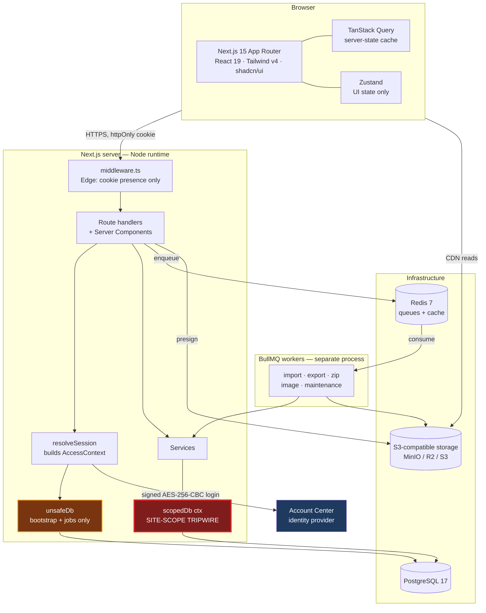
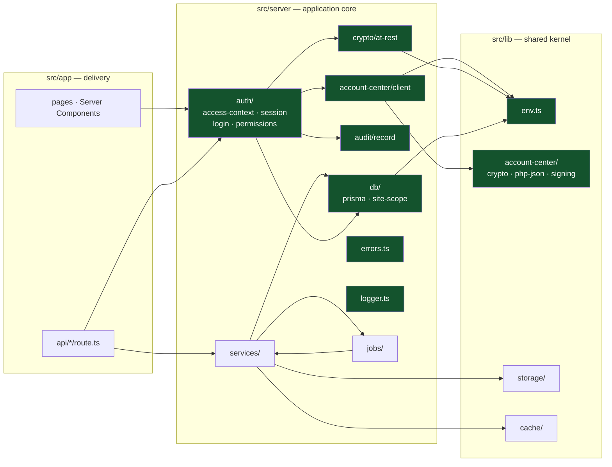
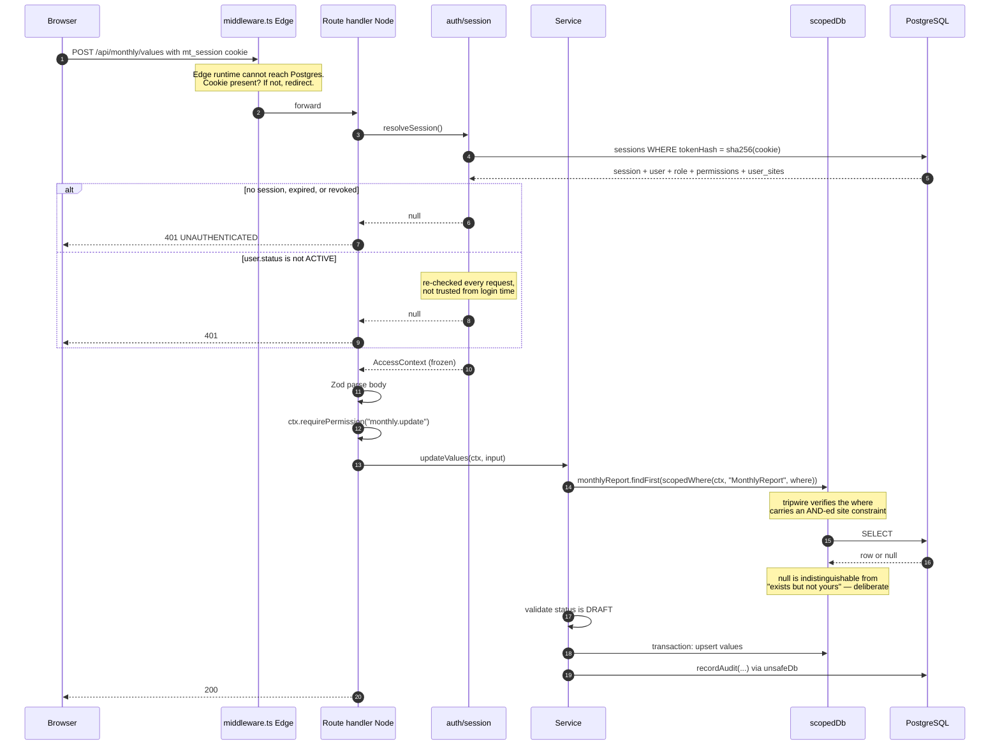
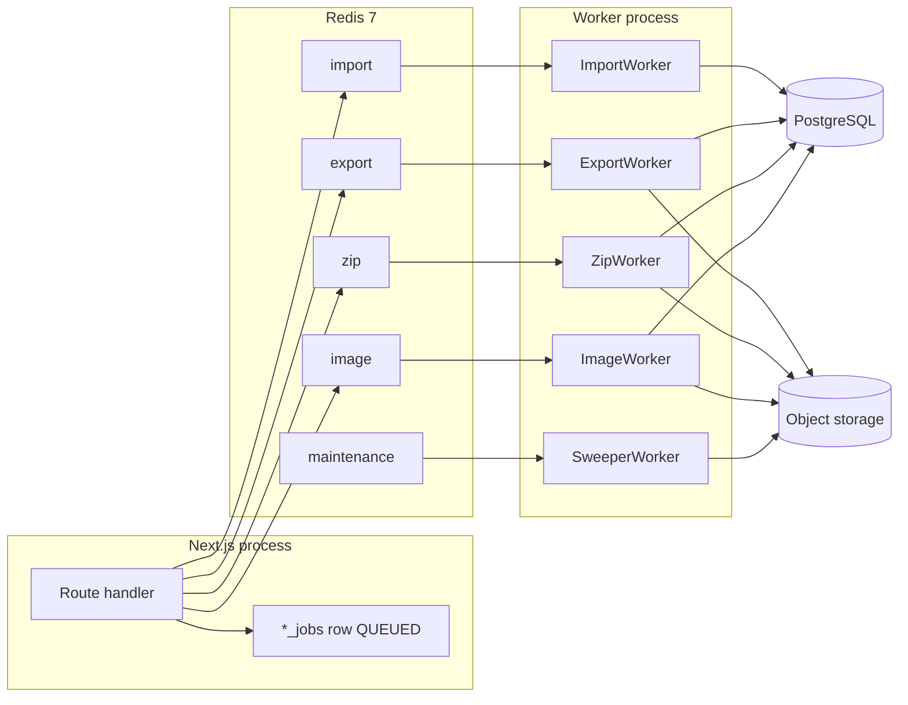

# System Architecture

**Enterprise Monthly & Turnover Management System**

> **Build status.** The server core is real: the Prisma schema and seed, validated environment,
> the Account Center crypto port and HTTP client, sessions, the permission catalogue, the
> `AccessContext`, the site-scoping tripwire, the audit writer, the error taxonomy, and the logger
> all exist under `src/server/` and `src/lib/`. **What does not exist: any route handler, any
> service or repository module, any UI beyond the `create-next-app` scaffold, any BullMQ queue or
> worker, any storage code, and `prisma/migrations/`.** Sections are marked **[BUILT]** or
> **[PLANNED]** throughout.

---

## 1. Shape of the system



The two database clients are the architectural centrepiece. `scopedDb(ctx)` refuses any query
against a site-owned table that does not carry a site constraint. `unsafeDb` is the raw client with
no guard, named so its appearance in a diff is conspicuous. Section 5 is the full argument.

---

## 2. Component view



Green = exists today. `services/`, `jobs/`, `storage/`, `cache/`, and everything under `src/app`
beyond the scaffold are planned.

**Dependency rule.** Arrows point inward and downward. `src/lib` never imports from `src/server` or
`src/app`. `src/server/db` never imports a service. This is what keeps `site-scope.ts` unit-testable
with no database and no request — which is exactly what `site-scope.test.ts` does.

---

## 3. Request lifecycle



### 3.1 Why middleware does so little

Next.js middleware runs on the **Edge runtime**. It cannot open a TCP connection to Postgres, so it
cannot validate a session, load a role, or resolve site assignments. Any design that puts real
authorisation in middleware is either wrong or is secretly making a network call on every request.

Middleware therefore does one cheap thing: if the session cookie is absent on a protected path,
redirect to the login page. That is a **user-experience optimisation, not a security control.**
Every authoritative check happens in the Node runtime, and the site-scope check happens again at the
database client. A request that skipped middleware entirely must still fail. **[PLANNED]** —
`middleware.ts` does not exist yet.

### 3.2 `AccessContext` **[BUILT]**

`src/server/auth/access-context.ts`. Constructed once per request by `resolveSession()`, frozen,
and threaded through every service and database call.

Its most important design decision is that **site reach is a discriminated union, not an array**:

```ts
type SiteScope =
  | { readonly kind: 'all' }
  | { readonly kind: 'limited'; readonly siteIds: readonly string[] };
```

The reasoning, quoted from the source: if "every site" were represented by an empty array, any bug
that emptied a normal user's site list would silently promote them to seeing everything — the
failure mode points the wrong way. With separate shapes, `all` and `none` cannot be confused, and
`limited` with zero entries matches zero rows, which is the safe direction to fail.

`isRoot` is then **derived from the scope shape**, not the role name:

```ts
get isRoot(): boolean { return this.siteScope.kind === 'all'; }
```

so a misconfigured role cannot grant the bypass without also granting `all` reach. The role name is
consulted exactly once, in `resolveSession()`, which sets `siteScope` to `ALL_SITES` when
`roleKey === 'ROOT'` and `limitedTo(user.sites)` otherwise.

The context also carries the guards themselves: `can` / `canAny` / `canAll` /
`requirePermission` / `requireAnyPermission` for RBAC, and `hasSite` / `requireSite` /
`requireSites` / `requireAnySite` / `narrowSiteFilter` for site checks. `toLogContext()` produces a
redacted shape for audit entries and structured logs.

`narrowSiteFilter` is worth calling out: for **list** endpoints a user picking a site they cannot
reach should quietly see nothing, because the site picker is user input rather than an attack. For
**point lookups** the same situation raises `SiteAccessDeniedError`. Two different behaviours for
two different situations, deliberately.

---

## 4. Layering

| Layer           | Location                                 | Responsibility                                                               | Status        |
| --------------- | ---------------------------------------- | ---------------------------------------------------------------------------- | ------------- |
| **Delivery**    | `src/app/**/route.ts`, Server Components | Parse, Zod-validate, resolve context, check permission, serialise            | **[PLANNED]** |
| **Service**     | `src/server/services/**`                 | Business rules, workflow transitions, transaction boundaries, audit emission | **[PLANNED]** |
| **Data access** | `src/server/db/**`                       | `scopedDb` / `unsafeDb`, the scope registry, the tripwire                    | **[BUILT]**   |
| **ORM**         | Prisma 7 + `@prisma/adapter-pg`          | Typed SQL, connection pool                                                   | **[BUILT]**   |

Note the deviation from a textbook clean architecture: **there is no repository layer, and there is
not intended to be one.** The site-scoping guarantee that a repository layer would normally provide
is instead enforced by the Prisma client extension in `scopedDb`, which covers every call site
including ones nobody has written yet. Services will call `scopedDb` directly using `scopedWhere()`
to build filters. Adding a repository layer on top would be indirection without a safety benefit.

**Why a service layer at all**, then? Because the same business operations are invoked from three
entry points — route handlers, React Server Components, and BullMQ workers. A worker has no
`Request` and no cookie. If business logic lives in route handlers, none of it is reachable from a
worker, and you end up with a second, subtly different implementation of "update a monthly report"
inside the import job. That divergence is where scoping bugs live.

**Transactions** are opened by services via `prisma.$transaction`, not by lower layers, so multiple
operations compose atomically. The canonical case: importing one Excel row upserts a
`monthly_reports` row, upserts N `monthly_values` rows, and writes one `audit_logs` row.

### 4.1 Error taxonomy **[BUILT]**

`src/server/errors.ts` defines `AppError` with a `statusCode`, a machine-readable `code`, and an
`isOperational` flag that decides whether an error is worth alerting on. Route handlers never
hand-roll status numbers.

| Error                                  | Status  | Code                   |
| -------------------------------------- | ------- | ---------------------- |
| `UnauthenticatedError`                 | 401     | `UNAUTHENTICATED`      |
| `AccountPendingError`                  | 403     | `ACCOUNT_PENDING`      |
| `AccountSuspendedError`                | 403     | `ACCOUNT_SUSPENDED`    |
| `NoSitesAssignedError`                 | 403     | `ACCOUNT_NO_SITES`     |
| `ForbiddenError`                       | 403     | `FORBIDDEN`            |
| `NotFoundError`                        | 404     | `NOT_FOUND`            |
| **`SiteAccessDeniedError`**            | **404** | `NOT_FOUND`            |
| `ValidationError`                      | 422     | `VALIDATION_FAILED`    |
| `ConflictError`                        | 409     | `CONFLICT`             |
| `RateLimitError`                       | 429     | `RATE_LIMITED`         |
| `UpstreamUnavailableError`             | 503     | `UPSTREAM_UNAVAILABLE` |
| `InternalError` / `UnscopedQueryError` | 500     | `INTERNAL`             |

`SiteAccessDeniedError` extends `NotFoundError` and reports **404, not 403** — a 403 confirms the
record exists, which lets an attacker enumerate other sites' data by probing identifiers. The
distinction is preserved internally: it carries `isSecurityEvent = true` and the full list of
`attemptedSiteIds`, so alerting can separate it from an ordinary 404.

`UnscopedQueryError` is `isOperational: false` because it is a programming error, not a user-facing
condition: it means a code path _would have_ leaked another site's data had it run.

### 4.2 Logging **[BUILT]**

`src/server/logger.ts` is a deliberately dependency-free structured logger: JSON in production,
object dumps in development. It redacts by **key name** — `password`, `secret`, `token`,
`access_token`, `jwt`, `authorization`, `signature`, `cookie`, `sessionsecret`, `encryptionkey`,
`apikey` — because a secret that reaches a log cannot be unlogged: shipping, backups, and
screenshots all copy it. It is the only sanctioned `console` boundary, enforced by an ESLint rule.

---

## 5. Site scoping: the tripwire

This is the most important section in the document.

### 5.1 The rule

> Every query touching site-owned data filters by the caller's sites. **Root, and only Root,
> bypasses the filter.**

`user_sites` is the entire basis of data isolation, as the schema states in its comment on the
model.

### 5.2 The strategy: explicit filters plus a tripwire

The implementation lives in `src/server/db/site-scope.ts` and `src/server/db/prisma.ts`. Its
governing decision, quoted from the source:

> The strategy is explicit filters plus a tripwire, rather than silent injection. Auto-rewriting
> queries looks safer but hides mistakes: when the rewrite fails to match a query shape it did not
> anticipate, the query runs unscoped and nothing complains. A tripwire that refuses the query
> converts that same mistake into a loud, immediate failure.

So there are two halves:

1. **Callers build the filter explicitly** with `scopedWhere(ctx, model, where)`.
2. **A Prisma client extension verifies they did**, and throws `UnscopedQueryError` if not.

This is a genuinely different trade from automatic injection. Automatic injection fails _open_ on
the query shapes it does not understand; this fails _closed_. The cost is that callers must
remember to call `scopedWhere` — but forgetting produces an immediate, loud 500 in development with
a message naming the model, the operation, and the fix, rather than a silent leak.

### 5.3 The scope registry

```ts
export const SITE_SCOPED_MODELS = {
  Site: { kind: 'ownId', field: 'id' },
  MonthlyReport: { kind: 'direct', field: 'siteId' },
  TurnoverReport: { kind: 'direct', field: 'siteId' },
  ImageAsset: { kind: 'direct', field: 'siteId' },
  MonthlyValue: { kind: 'relation', relation: 'report', field: 'siteId' },
  TurnoverValue: { kind: 'relation', relation: 'report', field: 'siteId' },
} as const satisfies Record<string, ScopeRule>;
```

Three rule kinds, because site ownership reaches the row three different ways: the row carries
`siteId` directly; the row **is** a site, so the constraint applies to its own primary key; or the
row inherits its site through a parent relation.

**The registry is asserted against the schema.** `site-scope.test.ts` parses `prisma/schema.prisma`,
finds every model with a `siteId` field, and fails if any is neither registered nor listed in an
`INTENTIONALLY_UNSCOPED` map **with a stated reason**. That converts "someone added a site-owned
table and forgot to register it" from a silent leak into a failing test. The current exclusions:

| Model       | Stated reason                                                                                                               |
| ----------- | --------------------------------------------------------------------------------------------------------------------------- |
| `UserSite`  | Join table; reached only through an already-scoped User or Site                                                             |
| `AuditLog`  | Scoped by the `audit.view` permission and filtered explicitly; `siteId` is nullable because system events belong to no site |
| `ImportJob` | Owned by the uploading user; `siteId` is nullable for multi-site files                                                      |
| `Setting`   | `siteId` is nullable and denotes a per-site override of a global default                                                    |

Each of those is a deliberate decision with a follow-up obligation — `AuditLog` and `ImportJob`
still need their explicit filters written when their repositories appear.

### 5.4 The tripwire predicate, and why `OR` is rejected

`hasSiteConstraint(model, where)` accepts only two shapes: the scope key at the top level, or
inside a top-level `AND` branch. `OR` and `NOT` are **not** traversed, and this is the subtlest and
most valuable part of the design.

```ts
// This mentions siteId. It returns every APPROVED report across every site.
{
  OR: [{ siteId: { in: ['site-jkt'] } }, { status: 'APPROVED' }];
}
```

A union **widens** the result set, so a constraint in one branch restricts nothing. A naive "does
this object mention `siteId` anywhere" check waves exactly that query through. `NOT` is excluded for
the mirror-image reason: it removes rows from the caller's sites rather than confining them to it.

`scopedWhere` composes under a top-level `AND` rather than merging keys, precisely so a
caller-supplied `OR` stays trapped in its own branch and can only narrow within the sites the other
branch already permits. The test suite asserts this directly.

Recursion is bounded at `MAX_AND_DEPTH = 8`, and a deeply nested input returns `false` rather than
throwing — a stack overflow in a security predicate is its own vulnerability.

### 5.5 Operation coverage — stated plainly

The source documents this honestly, and so should this page: an overstated guarantee is worse than a
documented gap.

| Operation class      | Members                                                                                                                      | Enforcement                                                                                                                                                                                                 |
| -------------------- | ---------------------------------------------------------------------------------------------------------------------------- | ----------------------------------------------------------------------------------------------------------------------------------------------------------------------------------------------------------- |
| **Blocked outright** | `findUnique`, `findUniqueOrThrow`                                                                                            | A unique selector cannot carry a site constraint, so the row would be fetched _before_ it could be checked. Callers use `findFirst` with `scopedWhere` instead, which returns `null` for out-of-scope rows. |
| **`where`-guarded**  | `findFirst`, `findFirstOrThrow`, `findMany`, `count`, `aggregate`, `groupBy`, `update`, `updateMany`, `delete`, `deleteMany` | `args.where` must carry an AND-ed site constraint                                                                                                                                                           |
| **`data`-guarded**   | `create`, `createMany`, `upsert`                                                                                             | The written `siteId` (or `id`, for `Site`) must fall inside the caller's scope                                                                                                                              |

**The documented gap:** creates on `MonthlyValue` and `TurnoverValue` are **not** verified, because
those rows reference their site only through `reportId` and checking would cost an extra query per
write. The compensating rule is that services must load the parent report through `scopedDb` first —
that read _is_ scope-checked, so a caller who cannot see the report cannot obtain an id to attach
values to. **This is a convention, not an enforced invariant**, and it is the weakest point of the
layer. It belongs in code review checklists.

### 5.6 `scopedDb` and `unsafeDb`

```ts
export function scopedDb(ctx: AccessContext) {
  return unsafeDb.$extends({
    query: {
      $allModels: {
        $allOperations({ model, operation, args, query }) {
          enforceSiteScope(ctx, model, operation, args);
          return query(args);
        },
      },
    },
  });
}
```

`$extends` returns a wrapper over the same engine and connection pool, so building one per request
is cheap — no new connections are opened.

`unsafeDb` is the raw client. It exists for the operations that legitimately run outside any user's
scope, and its name is chosen to make its appearance in a diff conspicuous. Current legitimate uses,
all of which are bootstrap or deliberately-unscoped cases:

| Caller            | Why                                                                                                                            |
| ----------------- | ------------------------------------------------------------------------------------------------------------------------------ |
| `auth/session.ts` | Runs _before_ an `AccessContext` exists — the bootstrap case the scoped client cannot serve                                    |
| `auth/login.ts`   | Same, plus the Root promotion path                                                                                             |
| `audit/record.ts` | The log records attempts **including refused ones**; passing it through the guard would drop exactly the entries worth keeping |
| `prisma/seed.ts`  | No user exists yet                                                                                                             |

Every one of those has a comment saying so. A new `unsafeDb` import without such a justification is
the thing to catch in review.

### 5.7 The Root bypass, and its cost

`enforceSiteScope` returns early when `ctx.isRoot`, and `buildSiteFilter` returns `null`. This is
why Root is not modelled as "a user assigned to every site": when site 101 is created Root sees it
immediately, with no assignment step and no window in which a new site is invisible to the person
administering the system.

The cost, stated plainly: **`isRoot` is a single boolean that switches off the primary
data-isolation control.** Constraints on it:

- Derived from the **scope shape** (`siteScope.kind === 'all'`), not from a role string, so a
  mislabelled role cannot grant it.
- `siteScope` is set to `ALL_SITES` in exactly one place: `resolveSession()`, on `roleKey === 'ROOT'`.
- `AccessContext` is frozen after construction.
- Root actions are audited like everyone else's.
- Asserted in `site-scope.test.ts`: Root's filter is `null`; a limited context's is not; a context
  with zero sites is **not** Root.

### 5.8 Alternatives considered

**Silent query rewriting.** Rejected — see the quotation in §5.2. It fails open on unanticipated
query shapes.

**A repository layer.** Rejected as redundant once the client extension exists; see §4.

**PostgreSQL Row-Level Security.** Genuinely stronger: the database itself refuses rows, covering
even raw SQL. Not adopted because it requires `SET LOCAL` on every checked-out connection, which
interacts badly with pooling — a pooled connection carrying the previous request's user id is a
catastrophic failure mode. **Recorded as the strongest available hardening if the threat model
tightens**; it would complement the tripwire rather than replace it.

---

## 6. Background jobs

**[PLANNED]** — `bullmq` and `ioredis` are installed; no queue or worker code exists.



| Queue         | Job                                                         | Progress row    | Trigger                              |
| ------------- | ----------------------------------------------------------- | --------------- | ------------------------------------ |
| `import`      | Parse `.xlsx`, validate, upsert reports and values          | `import_jobs`   | User upload                          |
| `export`      | Build XLSX/CSV/PDF, upload, set `fileUrl` + `expiresAt`     | `export_jobs`   | User request                         |
| `zip`         | Stream selected images into an archive                      | `download_jobs` | Selection above `ZIP_SYNC_THRESHOLD` |
| `image`       | Thumbnail via `sharp`, backfill `width`/`height`            | `image_assets`  | After upload                         |
| `maintenance` | Delete artifacts past `expiresAt`, prune expired `sessions` | —               | Repeatable schedule                  |

**Design rules:**

**The database row is the source of truth for the user; Redis is for the worker.** Redis is a queue
with retention limits and BullMQ trims completed jobs. If history lived only there, a user could not
see last week's failed import.

**`maxmemory-policy noeviction`** — set in `docker-compose.yml` **[BUILT]**. Under eviction Redis
would silently drop a queued job under memory pressure, losing a user's export with no error
anywhere: a data-loss bug that manifests only under load, which is the worst kind.

**Workers must build their own `AccessContext` and use `scopedDb`.** A job payload carries the
`userId` and the filters, **not** a pre-computed row-ID list assumed safe. If the user's site
assignments were revoked between enqueue and execution, the job must reflect that. A job is not a
capability token. This is the single most important rule for whoever writes the workers, because
`unsafeDb` is sitting right there and using it would be easy.

**Separate process.** A large `sharp` resize or a 50k-row import must not degrade interactive
latency. Development may run both in one process; production runs separate deployables from one
image.

**Idempotency.** Retries are normal. Imports are idempotent via `@@unique([siteId, reportDate])`;
thumbnails overwrite deterministically; sweepers are naturally idempotent. Any new job type must
state its strategy before it ships.

---

## 7. Caching

**[PLANNED]** — no caching code exists.

| Tier    | Technology                         | Holds                                                        | Invalidation                          |
| ------- | ---------------------------------- | ------------------------------------------------------------ | ------------------------------------- |
| Client  | TanStack Query                     | Responses for the current session                            | Staleness + invalidation on mutation  |
| Request | `React.cache`                      | `AccessContext`, settings, resolved once per request         | Ends with the request                 |
| Server  | `unstable_cache` + `revalidateTag` | Catalogue data: `monthly_columns`, `turnover_games`, `sites` | Tag revalidation on master-data write |
| Shared  | Redis                              | Cross-instance dashboard rollups, resolved settings          | TTL + explicit delete                 |

### 7.1 The cache-key rule

> **Any cache key holding site-scoped data must include a stable hash of the caller's resolved site
> IDs, or a `root` marker.**

This is the easiest way to destroy the isolation property the whole tripwire exists to guarantee —
and note that **the tripwire cannot catch it**, because the leak happens after a correctly scoped
query returned. A dashboard rollup cached under `dashboard:2026-07` and served to the next caller
hands one user another user's sites.

Practical form: `dashboard:rollup:{scopeHash}:{from}:{to}:{granularity}`. Root gets a fixed `root`
marker rather than a hash of every site, so the cache does not fragment as sites are added.

Catalogue data is not site-scoped and is cached globally; that is safe, which is why it is called
out separately.

### 7.2 What is deliberately not cached

Anything a user is about to edit. Grid data for a `DRAFT` report is read fresh — a stale cell in an
editable grid produces a lost update the user cannot see or explain.

---

## 8. Storage abstraction

**[PLANNED]** — `@aws-sdk/client-s3` and `@aws-sdk/s3-request-presigner` are installed and unused.

One narrow interface in `src/lib/storage/`: `put`, `get`, `delete`, `presignGet`, `presignPut`,
`publicUrl`. One S3-compatible implementation, configured entirely from validated env.

**Why an interface for one implementation.** Not provider portability — S3, R2, and MinIO already
speak the same API. It exists so services depend on something small enough to fake in a unit test,
and so the CDN-URL decision lives in one place: `publicUrl()` builds from `S3_PUBLIC_URL`, which is
the MinIO endpoint locally and the CDN hostname in production.

**`S3_FORCE_PATH_STYLE` is explicit, not inferred.** MinIO requires path-style; R2 and S3 use
virtual-hosted. Getting it wrong 404s every asset with no other symptom, so `env.ts` makes it a
required `'true' | 'false'` rather than something guessed from the hostname.

**Key layout:**

```
public/{siteId}/{yyyy}/{mm}/{assetId}.{ext}         # CDN-readable
public/{siteId}/{yyyy}/{mm}/{assetId}_thumb.webp
private/exports/{exportJobId}.{xlsx|csv|pdf}        # presigned only
private/archives/{downloadJobId}.zip                # presigned, expires
private/imports/{importJobId}/{originalName}
```

Keys are generated from UUIDs, never from `image_assets.originalName` — user-supplied filenames are
a path-traversal and collision vector, which is why the storage key (`fileName`) is a separate,
uniquely-indexed column from the display name. Date segments keep any prefix from accumulating
hundreds of thousands of objects.

`docker-compose.yml`'s `minio-init` opens anonymous download on the `public` prefix so CDN URLs
resolve in development the way they will behind R2 **[BUILT]**. Everything else is reachable only
through a presigned URL, which delivers exports and archives without proxying bytes through Node.

---

## 9. Folder structure

Directories marked `(new)` do not exist yet.

```
prisma/
  schema.prisma                  BUILT — 19 models, 7 enums
  seed.ts                        BUILT — permissions, roles, sites, columns, games, Root
  migrations/                    (new) — NOTHING HAS BEEN APPLIED TO A DATABASE

tools/php-parity/
  AesCbc256.php                  BUILT — verbatim customer library, do not edit
  generate-vectors.php           BUILT — regenerates the golden fixture

src/
  app/
    layout.tsx  page.tsx  globals.css     BUILT (create-next-app default)
    (auth)/login/                          (new)
    (app)/dashboard|monthly|turnover|gallery|master-data|audit|settings/   (new)
    api/                                   (new)
  middleware.ts                            (new)

  server/                        never imported by a client component
    account-center/client.ts     BUILT — the HTTP call, response normalisation
    auth/
      access-context.ts          BUILT — AccessContext, SiteScope
      login.ts                   BUILT — the login pipeline and activation gate
      permissions.ts             BUILT — 48-permission catalogue + 6 role presets
      session.ts                 BUILT — create/resolve/destroy/revoke
    audit/record.ts              BUILT — sanitising audit writer
    crypto/at-rest.ts            BUILT — AES-256-GCM for secrets at rest
    db/
      prisma.ts                  BUILT — scopedDb, unsafeDb, the tripwire
      site-scope.ts              BUILT — registry, filters, predicate
      site-scope.test.ts         BUILT — isolation suite
    errors.ts                    BUILT — typed error taxonomy
    logger.ts                    BUILT — redacting structured logger
    services/                    (new)
    jobs/                        (new)

  lib/
    env.ts                       BUILT — Zod-validated server env
    account-center/              BUILT — crypto, php-json, signing, parity tests
    storage/  cache/  validation/  utils.ts    (new)

  components/  hooks/  stores/  types/         (new)
  generated/prisma/              generated by `prisma generate` — gitignored
```

### 9.1 Two conventions worth knowing

**`src/server/**` must never be imported by a client component.** It transitively imports
`src/lib/env.ts`, which **throws if evaluated in a browser bundle** — deliberately, so an accidental
secret leak becomes a build-time failure rather than a shipped bundle containing
`ACCOUNT_CENTER_SECRET`. That guard is **[BUILT]**, which is what makes the boundary enforceable
rather than merely documented.

**The Prisma client is generated to `src/generated/prisma`** and imported as
`@/generated/prisma/client`. Build output: gitignored, never edited, regenerated by
`npm run db:generate`.

---

## 10. Local infrastructure **[BUILT]**

`docker-compose.yml`, project name `monthly-turnover`.

| Service      | Image                | Ports      | Notable configuration                                                                                                                                                                 |
| ------------ | -------------------- | ---------- | ------------------------------------------------------------------------------------------------------------------------------------------------------------------------------------- |
| `postgres`   | `postgres:17-alpine` | 5432       | `--encoding=UTF8 --locale=C`; `shared_buffers=512MB`, `work_mem=16MB`, `effective_cache_size=1536MB`, `random_page_cost=1.1`, `log_min_duration_statement=500`, `max_connections=200` |
| `redis`      | `redis:7-alpine`     | 6379       | `--appendonly yes --maxmemory-policy noeviction`                                                                                                                                      |
| `minio`      | `minio/minio:latest` | 9000, 9001 | `minioadmin` / `minioadmin`                                                                                                                                                           |
| `minio-init` | `minio/mc:latest`    | —          | Creates `monthly-assets`, opens anonymous download on `public`                                                                                                                        |

Three settings are load-bearing rather than incidental:

- **`--locale=C`** — without it the image inherits the host locale and index ordering differs
  between machines, so a sort order correct on one laptop is wrong on another.
- **`log_min_duration_statement=500`** — surfaces slow queries in development instead of after the
  EAV tables reach millions of rows.
- **`maxmemory-policy noeviction`** — see §6.

Production uses managed equivalents (RDS/Cloud SQL, ElastiCache, Cloudflare R2). Only connection
strings change, because the app talks to MinIO through the same S3 API it would use against R2.

### 10.1 Connection pooling **[BUILT]**

Prisma 7 dropped the bundled query engine in favour of driver adapters, so the pool is now
node-postgres and tunable directly. `src/server/db/prisma.ts` sets `max: 20`,
`idleTimeoutMillis: 30_000`, `connectionTimeoutMillis: 10_000` — sized for the app's own
concurrency, not the database's ceiling, because several instances share one Postgres and each
holding a large idle pool is how "too many connections" happens under load.

The client is cached on `globalThis` outside production: the Next.js dev server reloads modules on
every edit, and without this the process accumulates a pool per reload until Postgres refuses new
clients.

### 10.2 Bootstrap

```bash
docker compose up -d
npm run db:migrate      # prisma migrate dev  — NO MIGRATION EXISTS YET
npm run db:seed         # tsx prisma/seed.ts
```

**Known gap:** the scripts exist in `package.json` and `prisma/seed.ts` is written, but
`prisma/migrations/` does not exist, so the schema has never been applied. Generating the initial
migration is the next blocking step.

---

## 11. Configuration **[BUILT]**

`src/lib/env.ts` parses the environment **once at module load** with Zod. A misconfigured
deployment fails at boot with a list of _every_ problem, rather than at 3am inside whichever request
first touched the bad variable. Two details worth copying into any new config code:

- **Errors are aggregated and sorted**, not thrown one at a time. Fixing a `.env` should take one
  pass, not five restarts.
- **`SKIP_ENV_VALIDATION=true`** exists solely so Docker image builds can run `next build` without
  runtime secrets. It must never be set in a running environment.

Types are inferred from the schema, so `env.S3_FORCE_PATH_STYLE` is a `boolean` transformed at parse
time and consuming code never re-parses it. `encryptionKeyBytes` is decoded from `ENCRYPTION_KEY`
once at load, so AES-GCM operations never re-parse the hex.

| Group          | Variables                                                                                                                   |
| -------------- | --------------------------------------------------------------------------------------------------------------------------- |
| Core           | `NODE_ENV`, `APP_URL`, `DATABASE_URL`                                                                                       |
| Account Center | `ACCOUNT_CENTER_URL`, `ACCOUNT_CENTER_CLIENT_ID`, `ACCOUNT_CENTER_SECRET`, `ACCOUNT_CENTER_TIMEOUT_MS`                      |
| Bootstrap      | `ROOT_EMAIL`                                                                                                                |
| Secrets        | `SESSION_SECRET` (≥32 chars), `ENCRYPTION_KEY` (64 hex), `SESSION_TTL_HOURS`                                                |
| Infrastructure | `REDIS_URL`                                                                                                                 |
| Storage        | `S3_ENDPOINT`, `S3_REGION`, `S3_BUCKET`, `S3_ACCESS_KEY_ID`, `S3_SECRET_ACCESS_KEY`, `S3_PUBLIC_URL`, `S3_FORCE_PATH_STYLE` |
| Limits         | `MAX_UPLOAD_SIZE_MB`, `ZIP_SYNC_THRESHOLD`                                                                                  |

`ROOT_PASSWORD` is **deliberately absent** — see `.env.example` and `docs/PRD.md` NG1.

**Note:** `SESSION_SECRET` is validated but **not yet consumed** by any code. Session tokens are
random 32-byte values whose SHA-256 is stored; nothing currently signs a cookie with this secret.
Either wire it up or remove it — a validated-but-unused secret invites false confidence.

---

## 12. Testing

| Level       | Scope                                        | Status                                                |
| ----------- | -------------------------------------------- | ----------------------------------------------------- |
| Parity      | Account Center crypto vs. PHP golden vectors | **[BUILT]** — `src/lib/account-center/crypto.test.ts` |
| **Scope**   | **Cross-site isolation**                     | **[BUILT]** — `src/server/db/site-scope.test.ts`      |
| Unit        | Services with faked dependencies             | **[PLANNED]** — no services exist                     |
| Integration | Real Postgres                                | **[PLANNED]** — no migration exists                   |
| E2E         | Login → activation gate → data entry         | **[PLANNED]**                                         |

The two existing suites are the two that matter most at this stage, and both are shaped around
_proving a property_ rather than exercising code:

**`crypto.test.ts`** asserts every expectation against values produced by the customer's real PHP
library (PHP 8.3.30), captured by `tools/php-parity/generate-vectors.php`. Drift fails CI rather
than failing production logins with an opaque signature rejection that is close to undebuggable from
the client side.

**`site-scope.test.ts`** is the test that G1 holds. Beyond the happy paths it pins the cases that
make a naive implementation unsafe: a site constraint inside `OR` is **rejected**; inside `NOT`
**rejected**; an `OR` nested in an `AND` branch **rejected**; `{ siteId: undefined }` — how an unset
variable reaches Prisma — **rejected**; 50-deep nesting terminates instead of overflowing. It also
parses the Prisma schema and fails if any model with a `siteId` is neither registered nor excused
with a written reason.

**Still missing, and the most valuable thing to add next:** an integration suite proving isolation
against a real database, and a test that a worker whose enqueuing user lost access mid-flight
produces the restricted result rather than the original one.

---

## Related documents

- `docs/PRD.md` — scope, personas, functional and non-functional requirements
- `docs/ERD.md` — every table, index, and the EAV tradeoff
- `docs/AUTH-FLOW.md` — login sequence, crypto protocol, RBAC and scoping rules
