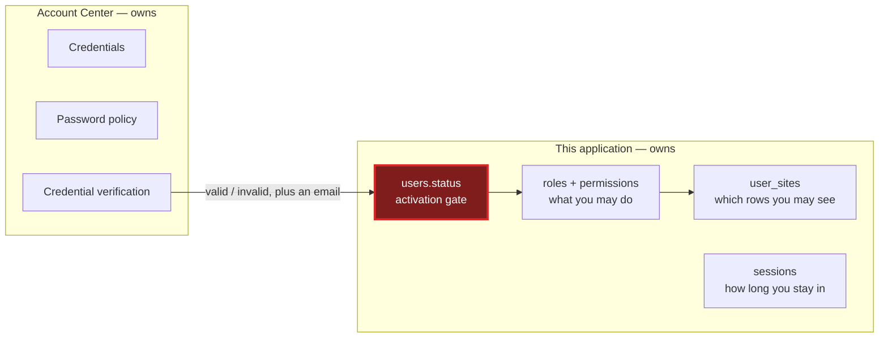
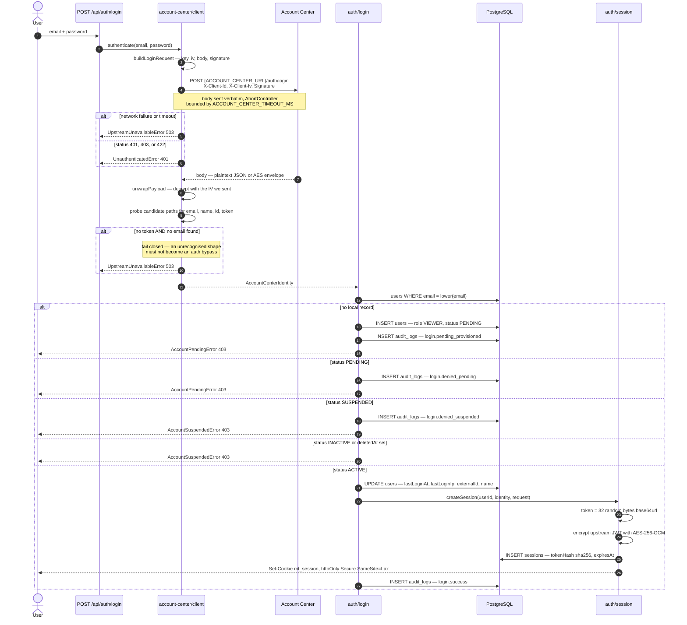
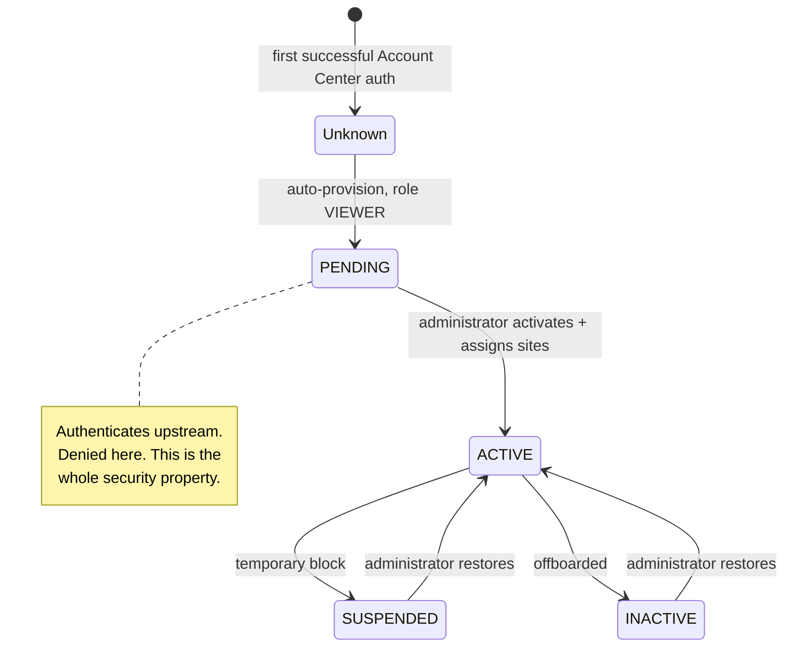
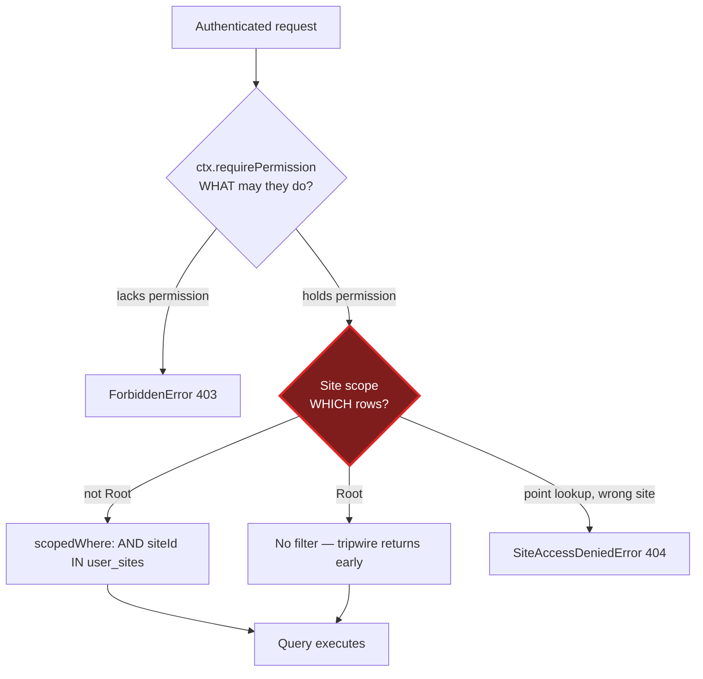

# Authentication and Authorisation

**Enterprise Monthly & Turnover Management System**

> **Build status.** The authentication core is **[BUILT]**: the crypto port with PHP parity tests,
> the Account Center HTTP client, the login pipeline and activation gate, session create/resolve/
> destroy/revoke, at-rest encryption, the 48-permission catalogue with six role presets, the
> `AccessContext`, and the seed. **What is missing: the `POST /api/auth/login` route handler, the
> login UI, `middleware.ts`, rate limiting, and `prisma/migrations/`** — so nothing has been run
> against a database yet. Marked per-section throughout.

---

## 1. The identity/authorisation split

Account Center is an **identity provider only**. It answers exactly one question:

> _Are these credentials valid, and who do they belong to?_

It does **not** tell this application what the user may do. This application owns all
authorisation — roles, permissions, sites, the user→site mapping, and activation status.



The security property this buys:

> A user who authenticates successfully at Account Center but has no `ACTIVE` local record is
> **denied access**. First-time authenticators are provisioned into `users` with `status = PENDING`
> and refused, until an administrator activates them and assigns sites.
>
> **A leaked Account Center credential grants nothing here.**

Three consequences worth internalising:

- **This application stores no password.** `prisma/schema.prisma` has no credential column, and
  `ROOT_PASSWORD` is deliberately absent from `.env.example` — a second authentication path would be
  weaker than the one it sits beside and outside the customer's audit trail.
- **The upstream JWT is never trusted for authorisation.** It is stored encrypted for making
  upstream calls; every decision here is made against the local user record. That is why
  `readTokenExpiry()` in the client parses the token's `exp` claim **without verifying its
  signature** — the claim is used only to know when to stop reusing the token.
- **Session validation is local.** If Account Center is unreachable, existing sessions keep working;
  only new logins fail. There is deliberately no break-glass local login.

---

## 2. Login sequence

Steps through session issue are **[BUILT]** in `src/server/auth/login.ts`,
`src/server/account-center/client.ts`, and `src/server/auth/session.ts`. The HTTP route that calls
`login()` is **[PLANNED]**.



### 2.1 Notes on the flow

**Provisioning assigns the least-privileged role, not no role.** A new account is created with
`roleId` pointing at `VIEWER` and `status = PENDING`. The role grants nothing while the status
blocks entry; giving them a valid role up front means activation is a single status change plus a
site assignment rather than a three-part edit.

**The seed must have run.** `provisionUser()` looks up the role by key and raises `InternalError`
with an actionable message — _run `npm run db:seed` before signing in_ — if the table is empty. This
is a real bootstrap dependency, not a theoretical one.

**Timing.** The source notes that the refusal is deliberately indistinguishable in timing from a
successful lookup: the user row is written before the error is raised either way.

**A user with no sites is let in.** `login()` logs a warning but does not block. The reasoning is
in the source: a blank dashboard with no explanation reads as a broken app. `NoSitesAssignedError`
(403, `ACCOUNT_NO_SITES`) exists so endpoints can say so plainly, and `requireAnySite()` raises it.

**The opaque cookie.** The browser receives 32 random bytes, base64url-encoded — never a JWT.
`sessions.tokenHash` stores the **SHA-256 hex digest**, so a database leak yields no usable
sessions.

**Rate limiting is still missing.** `RateLimitError` exists in the taxonomy; nothing raises it.
Account Center is a shared upstream and this app must not become a credential-stuffing amplifier
against it. This is the most important remaining gap in the login path.

### 2.2 The ROOT_EMAIL self-activation path — read this carefully

`login()` contains a bootstrap branch worth understanding before you are surprised by it:

```
if (isRootEmail && (user.status !== 'ACTIVE' || user.role?.key !== 'ROOT')) {
    user = await promoteToRoot(user.id);
}
```

Whoever authenticates with the address in `ROOT_EMAIL` is **automatically activated and promoted to
the ROOT role on every login**, even if an administrator previously demoted or suspended that
account. The seed does the same thing (`update: { roleId: rootRole.id, status: 'ACTIVE' }`).

The justification given in the source is sound: env is server-controlled, so anyone who can set it
already owns the deployment, and this is what keeps the first administrator from being locked out
with nobody able to approve them. It is logged at `warn` level when it fires.

Two operational consequences follow, and they are not obvious:

1. **`ROOT_EMAIL` is a live grant, not a one-time bootstrap.** Changing it to a colleague's address
   hands them Root on their next login. It should be treated with the same care as a secret, and
   changes to it should go through the same review as a production credential rotation.
2. **A compromised Account Center account matching `ROOT_EMAIL` bypasses the activation gate
   entirely** — which is the one case where the "leaked credential grants nothing" property does not
   hold. Root should therefore be an address with no other purpose, and ideally one that Account
   Center protects with MFA.

Neither is a defect, but both deserve to be a deliberate decision rather than a discovery.

---

## 3. The Account Center crypto protocol **[BUILT]**

A port of the customer's production Laravel library. The reference implementation is
`tools/php-parity/AesCbc256.php` — a **verbatim copy, not to be modified**. Golden vectors generated
from it by `tools/php-parity/generate-vectors.php` (PHP 8.3.30) are committed to
`src/lib/account-center/__fixtures__/php-vectors.json` and asserted in `crypto.test.ts`.

**Why this much ceremony.** A divergence of a single byte produces a signature the server rejects
with no useful diagnostic — from the client side it is indistinguishable from a wrong password.
Catching drift in CI is enormously cheaper than debugging it in production.

### 3.1 Key derivation — md5 hex as 32 raw ASCII bytes

```
key = md5(ACCOUNT_CENTER_SECRET)          // 32 lowercase hex characters
    → Buffer.from(md5Hex, 'latin1')       // those 32 characters AS BYTES
```

**The hex digest is NOT hex-decoded.** PHP hands the 32-character string straight to OpenSSL, and
PHP strings are byte arrays, so OpenSSL receives 32 ASCII bytes — exactly the key length AES-256
requires. Hex-decoding would yield 16 bytes and silently select AES-128 semantics in a less strict
implementation.

The port reproduces this with `latin1`, which maps each character to one byte. The test asserts both
halves of the trap:

```
expect(KEY).toHaveLength(32);                              // what PHP does
expect(Buffer.from(fixture.key, 'hex')).toHaveLength(16);  // the wrong path
```

|                                   |                                                                    |
| --------------------------------- | ------------------------------------------------------------------ |
| `ACCOUNT_CENTER_SECRET` (fixture) | `account-center-shared-secret-2023`                                |
| `md5(secret)`                     | `ad0cd02f3cb990a5705586f8c2c29483`                                 |
| Key bytes                         | `61 64 30 63 64 30 32 66 …` — ASCII codes of `a`, `d`, `0`, `c`, … |

### 3.2 The IV — 16 hex characters

PHP: `substr(md5(uniqid()), 0, 16)` — 16 lowercase hex characters used as 16 ASCII bytes, the block
size AES-CBC requires.

The port makes **one deliberate deviation**: `randomBytes(16).toString('hex').slice(0, 16)`.
`uniqid()` is time-derived and therefore predictable; this uses a CSPRNG. The output shape and wire
format are identical, so the server cannot tell the difference — strictly stronger, not merely
different.

**An honest note on IV entropy.** The wire format is 16 _hex characters_, carrying 8 bytes —
**64 bits** — of information, even though 16 bytes are fed to AES. `randomBytes(16)` generates 128
bits and `.slice(0, 16)` discards half. That ceiling is imposed by the inherited protocol, not by
the port; raising it would require the customer's server to change. It is a large improvement over a
time-derived value and adequate for CBC's requirement that IVs not repeat, but it is not 128 bits
and should not be described as such.

Length is validated, not truncated: a wrong-sized IV throws `AccountCenterCryptoError`.

### 3.3 Double base64 — the detail that is easiest to lose

```php
$raw           = openssl_encrypt($str, 'AES-256-CBC', $key, false, $iv);  // $options = false
$base64_string = base64_encode($raw);                                     // encoded AGAIN
```

`openssl_encrypt` with `$options = false` **already returns base64**. PHP then base64-encodes that
base64 string a second time. **The output is DOUBLE base64.** Reading the PHP quickly, it is natural
to assume `$raw` is binary. It is not.

The port reproduces it explicitly:

```
inner = Buffer.concat([cipher.update(plaintext,'utf8'), cipher.final()]).toString('base64');
outer = Buffer.from(inner, 'latin1').toString('base64');
```

Worked example (`aesVectors[0]`), verifiable by hand:

|                          |                                    |
| ------------------------ | ---------------------------------- |
| plaintext                | `hello`                            |
| iv                       | `0123456789abcdef`                 |
| inner (one base64 layer) | `qxVpGoUb191RYjJNxyTLdg==`         |
| **outer (transmitted)**  | `cXhWcEdvVWIxOTFSWWpKTnh5VExkZz09` |

Decoding the transmitted value once yields base64, not plaintext. The test asserts exactly that.

#### A structural property the signing contract relies on

Because the inner layer emits only ASCII bytes (all `< 0x80`), the six-bit groups of the outer
encoding are bounded:

| Group | Formula                           | Bound                 |
| ----- | --------------------------------- | --------------------- |
| g1    | `b1 >> 2`                         | ≤ 31                  |
| g2    | `((b1 & 0x03) << 4) \| (b2 >> 4)` | ≤ 55                  |
| g3    | `((b2 & 0x0F) << 2) \| (b3 >> 6)` | ≤ 61                  |
| g4    | `b3 & 0x3F`                       | 62 and 63 unreachable |

`g4 = 63` would require a source byte of `0x3F` (`?`) or `0x7F` (DEL); `g4 = 62` would require
`0x3E` (`>`) or `0x7E` (`~`). None are in the base64 alphabet the inner layer produces.

**Therefore the double-base64 output can never contain `+` (index 62) or `/` (index 63).**

Asserted, not assumed: PHP checked 20,000 samples with zero hits; the TypeScript suite repeats it
over 2,000. The practical consequence is that the encrypted password embedded in the login body
never contains a `/`, so PHP's slash-escaping is a no-op _for this specific payload_ — the fixture
confirms `jsonBodyHasEscapedSlash` is false for every login case.

**Do not conclude the escaping is unnecessary.** It is still required for the `email` field, for any
future payload, and for the `\uXXXX` rule (§3.5), which is emphatically not a no-op. The _inner_
layer of every login signature in the fixture does contain `+` and `/`; the outer encoding is
precisely what removes them.

This property is also load-bearing at runtime: `looksEncrypted()` in the client uses the base64
alphabet to decide whether a response body is an AES envelope.

### 3.4 The encrypt/decrypt IV asymmetry

The two functions take the IV in **different forms**, and this is intentional rather than a bug in
the original:

| Function                          | IV parameter                | Rationale                                                    |
| --------------------------------- | --------------------------- | ------------------------------------------------------------ |
| `encrypt(plaintext, key, iv)`     | **RAW** 16-character string | The caller has just generated it                             |
| `decrypt(payload, key, ivBase64)` | **BASE64**                  | The IV arrives on the wire as `X-Client-Iv`, which is base64 |

Faithfully inherited from PHP:

```php
public function decrypt(string $str, string $key, $iv) {
    $base64_string = base64_decode($str);
    $iv            = base64_decode($iv);      // <-- decrypt decodes; encrypt does not
    ...
}
```

Easy to "fix" and thereby break. The test suite pins it deliberately:

```
// decrypt() expects a BASE64 iv; handing it the raw iv must fail loudly.
expect(() => decrypt(vector.ciphertext, KEY, vector.iv)).toThrow();
```

Both directions validate that the decoded IV is 16 bytes, so a mistake surfaces as a clear error
rather than as garbage plaintext. The asymmetry is why `client.ts` passes
`request.headers['X-Client-Iv']` — already base64 — straight into `decrypt()`.

### 3.5 PHP `json_encode()` reproduced byte-for-byte

> **`Signature` is AES over the exact bytes of `json_encode($body)`. The transmitted body and the
> signed string must agree down to the byte, or the server rejects the login.**

This makes JSON serialisation part of the cryptographic contract, which is not where anyone expects
to find it. `JSON.stringify` differs from PHP's default `json_encode` in exactly two ways:

|               | PHP                                                    | JavaScript        |
| ------------- | ------------------------------------------------------ | ----------------- |
| Forward slash | `\/`                                                   | `/`               |
| Non-ASCII     | `\uXXXX`, lowercase (surrogate pairs for astral chars) | literal character |

`phpJsonEncode()` applies both:

```
JSON.stringify(value)
  .replace(/\//g, '\\/')
  .replace(/[^\x00-\x7f]/g, c => `\\u${c.charCodeAt(0).toString(16).padStart(4,'0')}`)
```

Everything else already matches, and the boundaries were verified rather than guessed:

- Quote, backslash, and C0 control characters use identical escapes in both.
- **DEL (`U+007F`) is left raw by both.** The regex boundary is `\x7f`, not `\x80`, precisely
  because of this. Getting it wrong is a one-character bug that breaks only payloads containing DEL.
- Neither escapes HTML-significant characters — PHP does not without the `JSON_HEX_*` flags.

#### Numbers are outside the contract, by design

`phpJsonEncode` **throws** on any numeric value at any depth, naming the path:

```
PhpJsonEncodeError: Numeric value at "a.b[0]" is outside the signing contract …
```

PHP renders float `1.0` as `"1.0"`; JavaScript renders `"1"`. That divergence would corrupt the
signature _silently_ — the request would be well-formed and simply rejected. A loud error at the
call site is far better than an unexplained 401 in production. Pass numeric values as strings.

### 3.6 The signed request

`buildLoginRequest()` in `src/lib/account-center/signing.ts`:

```
key       = deriveKey(secret)
encPwd    = encrypt(password, key, iv)                      // double base64
body      = phpJsonEncode({ email, password: encPwd })      // KEY ORDER MATTERS
signature = encrypt(body, key, iv)                          // double base64
```

| Header         | Value                                                              |
| -------------- | ------------------------------------------------------------------ |
| `Content-Type` | `application/json`                                                 |
| `X-Client-Id`  | `ACCOUNT_CENTER_CLIENT_ID` (Laravel `services.accountcenter.name`) |
| `X-Client-Iv`  | base64 of the **raw** IV                                           |
| `Signature`    | `encrypt(body, key, iv)`                                           |

Three properties that are easy to break:

1. **Key order is part of the signature.** PHP emits `email` before `password`, and the signature
   covers that exact serialisation. Reordering the object literal changes the bytes.
2. **The body string must be transmitted verbatim.** `SignedRequest.body` is a `string` for this
   reason, and `client.ts` passes it straight to `fetch` with a comment saying so. Parsing and
   re-serialising — which any well-meaning HTTP wrapper might do — produces different bytes than the
   ones `Signature` covers.
3. **The password is covered twice** — once encrypted inside the body, and again as part of the body
   the signature encrypts.

Worked example (`loginPayloads[0]`):

```
secret  : account-center-shared-secret-2023
key     : ad0cd02f3cb990a5705586f8c2c29483   (as 32 ASCII bytes)
iv      : 0f1e2d3c4b5a6978
email   : operator@example.com
password: Str0ngP@ss!

encPwd  : NXFrWHN4bktBQTlQK2ZiR3FZUEs3UT09
body    : {"email":"operator@example.com","password":"NXFrWHN4bktBQTlQK2ZiR3FZUEs3UT09"}

X-Client-Id : monthly-turnover-app
X-Client-Iv : MGYxZTJkM2M0YjVhNjk3OA==
Signature   : WDZIWm51WFBSMFhNUVYrdGowd3VtOFEvUUk5WS9VbnllNEJmSkVoZjk2ZnJmVXRZamNY
              UHM4NS9zUWJKb2xyM2RSVnppMVlnMWcxUUFUSmwwUXJnVExCRXVpeTRxR3FjZkZiSk1Q
              NEdPKzQ9
```

### 3.7 The client and its response handling **[BUILT]**

`src/server/account-center/client.ts`. The endpoint is
`new URL('/auth/login', env.ACCOUNT_CENTER_URL)`, POSTed with an `AbortController` bounded by
`ACCOUNT_CENTER_TIMEOUT_MS` and `cache: 'no-store'`.

**The response shape is not yet known**, and the client is built to make that survivable rather than
pretending otherwise:

- **`unwrapPayload()`** accepts either plaintext JSON or an AES envelope. It tries JSON first; if the
  parsed object carries an encrypted string under `data`, that field is decrypted in place. If the
  body is not JSON at all but looks like base64, the whole body is decrypted.
- **Field probing.** `email`, `name`, `externalId`, and `token` are each hunted through an ordered
  list of candidate paths (`user.email`, `data.user.email`, `data.email`, `email`,
  `result.user.email`, …). Only the email is genuinely required.
- **`describeShape()`** logs a payload's _structure_ — keys and value types, never values — so first
  contact with a real Account Center is adjustable in one iteration. Logging the payload itself would
  write a live JWT to disk.

**It fails closed.** A 200 carrying neither a token nor a recognisable email raises
`UpstreamUnavailableError`, with a log line naming the file to edit. As the source puts it, this is
what keeps an unexpected response shape from becoming an authentication bypass. An explicit
`success: false` in the body is also treated as a rejection.

Status mapping: 401/403/422 → `UnauthenticatedError` ("Incorrect email or password."); any other
non-OK status or a network/timeout failure → `UpstreamUnavailableError` (503).

**Still to confirm with the customer:** whether `/auth/login` is the correct path (it is currently an
assumption — `AccountCenter.php`, the wrapper that would confirm it, is referenced in comments but is
**not present in this repository**; only `AesCbc256.php` and `generate-vectors.php` are), and the
real response envelope so the probing can be narrowed to the actual shape.

### 3.8 Security properties of the inherited protocol

Stated candidly. **These are properties of the customer's existing protocol, which this port
reproduces faithfully. They are not defects introduced here, and none can be fixed unilaterally —
the server would stop accepting our requests.**

| Property                                        | Assessment                                                                                                                                                                                                     |
| ----------------------------------------------- | -------------------------------------------------------------------------------------------------------------------------------------------------------------------------------------------------------------- |
| `Signature` is AES-CBC of the body, not an HMAC | **Encryption is not authentication.** CBC is malleable and provides no integrity guarantee in the cryptographic sense. HMAC-SHA256 over the body would be the correct primitive. Mitigated in practice by TLS. |
| Key is `md5(secret)` hex                        | The AES-256 key is 32 bytes but carries at most **128 bits** of entropy, and less if the secret is low-entropy.                                                                                                |
| IV entropy                                      | 64 bits — see §3.2.                                                                                                                                                                                            |
| No replay protection                            | No nonce, timestamp, or expiry in the signed payload. A captured request is replayable if TLS is stripped.                                                                                                     |
| Double base64                                   | Wastes ~33% of payload size for no security benefit. Purely a compatibility requirement.                                                                                                                       |

**What the port improves:** `getIV()` no longer derives from `uniqid()`. That was the one change
available that the server cannot detect, and it was taken.

**Contrast with `src/server/crypto/at-rest.ts`**, which is _ours_ and therefore chosen freely: it
uses **AES-256-GCM**, which authenticates as well as encrypts, so a tampered ciphertext fails loudly
instead of decrypting to attacker-influenced bytes. The format is `v1.<iv>.<tag>.<ciphertext>`, all
base64url, with a 12-byte IV (the size GCM is specified for). The version prefix makes key rotation
possible later without guessing at old rows. That contrast is the clearest illustration of which
constraints are inherited and which are chosen.

**If the customer is ever willing to change the server side,** the ordered list is: HMAC instead of
CBC-as-signature; a timestamp and nonce in the signed payload; a proper KDF instead of raw md5; and
dropping the second base64 layer. Worth raising; not worth breaking login over.

---

## 4. The activation gate **[BUILT]**



| `users.status`            | Can log in | Error raised                | Audit action             |
| ------------------------- | ---------- | --------------------------- | ------------------------ |
| `PENDING`                 | **No**     | `AccountPendingError` 403   | `login.denied_pending`   |
| `ACTIVE`                  | Yes        | —                           | `login.success`          |
| `SUSPENDED`               | **No**     | `AccountSuspendedError` 403 | `login.denied_suspended` |
| `INACTIVE`                | **No**     | `AccountSuspendedError` 403 | —                        |
| any, with `deletedAt` set | **No**     | `AccountSuspendedError` 403 | —                        |

First-time provisioning writes `login.pending_provisioned` and refuses.

**The gate is re-checked on every request, not only at login.** `resolveSession()` re-reads
`user.status` and `user.deletedAt` and returns `null` if the account is no longer active, logging a
warning. Suspending a user therefore takes effect immediately rather than when their session
happens to lapse. `revokeAllSessions(userId)` additionally ejects them rather than merely blocking
their next call.

Activation stamps `activatedAt` and `activatedById` (a real self-relation on `users`). The
administration UI **[PLANNED]** must require at least one `user_sites` assignment in the same
action — an `ACTIVE` user with no sites can log in and see nothing, which reads to them as a broken
application rather than as a permissions state.

---

## 5. Authorisation model **[BUILT]**

Two **independent** checks guard every operation. Neither substitutes for the other.



Holding `monthly.update` does not grant access to a site the user is not assigned to. Being assigned
to a site does not grant the ability to approve reports in it.

### 5.1 Roles **[BUILT]**

Defined as `ROLE_PRESETS` in `src/server/auth/permissions.ts` and written by `prisma/seed.ts`. All
six are seeded with `isSystem: true`.

`roles.key` is the stable machine key — code branches on `key`, never on `name`. `roles.level`
encodes authority: **lower number means more authority**, used to stop a user granting or editing a
role at or above their own level.

| Role        | `key`         | `level` | Permissions                           | Site reach     |
| ----------- | ------------- | ------- | ------------------------------------- | -------------- |
| Root        | `ROOT`        | 0       | `'*'` — all 48, including future ones | **All sites**  |
| Super Admin | `SUPER_ADMIN` | 10      | 43 of 48, enumerated                  | Assigned sites |
| Manager     | `MANAGER`     | 20      | 25                                    | Assigned sites |
| Supervisor  | `SUPERVISOR`  | 30      | 17                                    | Assigned sites |
| Operator    | `OPERATOR`    | 40      | 13                                    | Assigned sites |
| Viewer      | `VIEWER`      | 50      | 8                                     | Assigned sites |

**Only ROOT is `'*'`, and SUPER_ADMIN is enumerated deliberately.** The source states the reason: if
Super Admin inherited every future permission automatically, adding a sensitive capability would
silently widen an existing role rather than requiring a decision. This is a good pattern to preserve.

Super Admin's preset holds 43 of the 48 permissions. The five it **excludes** are exactly
`gallery.download.all`, `site.delete`, `user.delete`, `role.create`, and `role.delete` — Root-only
by default, which is a coherent line: the irreversible deletions plus the two capabilities that
would let a Super Admin escalate (minting a role, or reading every site's gallery).

**Super Admin being site-scoped is deliberate and counter-intuitive.** They administer the system
without automatically reading every site's financial figures. Granting them a site is an explicit
`user_sites` row, and that act is itself audited. Root is the only principal for whom "administers
the system" and "sees all data" coincide.

**Presets are starting points, not policy.** Administrators can reassign permissions through the
role editor afterwards. The seed replaces rather than merges role permissions, so a permission
removed from a preset actually disappears on the next seed run — worth knowing before editing
presets on a live system.

### 5.2 Permissions **[BUILT]**

`PERMISSIONS` in `src/server/auth/permissions.ts` is a single `as const` array that drives three
things at once: the `PermissionKey` union the type checker enforces at every guard, the rows the
seed inserts into `permissions`, and the grouping the role editor renders.

The reason they are derived from one declaration is worth quoting: it stops a permission from being
checked in code but missing from the database, **which fails open in the worst way — the guard
silently passes because nobody holds a permission that does not exist.**

48 permissions across 11 modules:

| Module    | Keys                                                                                   |
| --------- | -------------------------------------------------------------------------------------- |
| Dashboard | `dashboard.view`, `dashboard.export`                                                   |
| Monthly   | `monthly.view/create/update/delete/approve/import/export`                              |
| Turnover  | `turnover.view/create/update/delete/approve/import/export`                             |
| Gallery   | `gallery.view/upload/delete/download`, `gallery.download.bulk`, `gallery.download.all` |
| Site      | `site.view/create/update/delete`                                                       |
| Game      | `game.view/create/update/delete`                                                       |
| Column    | `column.view/create/update/delete`                                                     |
| User      | `user.view/activate/update/suspend/delete`, `user.assign_site`                         |
| Role      | `role.view/create/update/delete`                                                       |
| Audit     | `audit.view`, `audit.export`                                                           |
| Setting   | `setting.view`, `setting.update`                                                       |

Guards accept only `PermissionKey`, so a typo is a build error rather than a check that never fires.
`AccessContext` exposes `can`, `canAny`, `canAll`, `requirePermission`, and `requireAnyPermission`.

### 5.3 Site scoping **[BUILT]**

> Every query touching site-owned data filters by the caller's sites, resolved from `user_sites`.

Enforced by a **Prisma client extension tripwire**, not by a repository layer: `scopedDb(ctx)`
refuses any query against a registered site-owned model whose `where` does not carry an AND-ed site
constraint, raising `UnscopedQueryError`. The full design — including why a constraint inside an
`OR` is rejected, which operations are covered, and the one documented gap — is in
`docs/ARCHITECTURE.md` §5.

The three checks `AccessContext` offers, and when each applies:

| Method                        | Behaviour                                              | Use for                                                         |
| ----------------------------- | ------------------------------------------------------ | --------------------------------------------------------------- |
| `requireSite(id)`             | Raises `SiteAccessDeniedError` (**404**)               | Point lookups and writes aimed at one site                      |
| `requireSites(ids)`           | Raises with **every** offending id, not just the first | Bulk operations, so the audit entry records the full attempt    |
| `narrowSiteFilter(requested)` | Silently intersects with the caller's sites            | **List endpoints** — a site picker is user input, not an attack |

The 404 on `requireSite` is deliberate: a 403 confirms the record exists, letting an attacker
enumerate other sites' data by probing identifiers. `SiteAccessDeniedError` carries
`isSecurityEvent = true` and `attemptedSiteIds` so alerting can still distinguish it from an ordinary 404.

**A user with no assignments sees nothing** — `limitedTo([])` produces `{ siteId: { in: [] } }`,
which matches nothing. Failing closed is the correct direction.

### 5.4 The Root bypass

Root's filter is `null` and the tripwire returns early. That is why Root is **not** modelled as "a
user assigned to every site": when site 101 is created, Root sees it immediately, with no assignment
step and no window in which the new site is invisible to the person administering the system.

The cost, stated plainly: **`isRoot` is a single boolean that switches off the primary
data-isolation control.** Constraints on it:

- Derived from the **scope shape** (`siteScope.kind === 'all'`), not from a role string, so a
  mislabelled role cannot grant it.
- `ALL_SITES` is assigned in exactly one place: `resolveSession()`, on `roleKey === 'ROOT'`.
- `AccessContext` is frozen after construction; `#permissions` is a private field.
- Root actions are audited like everyone else's.
- Asserted in `site-scope.test.ts`: Root's filter is `null`, a limited context's is not, and a
  context with **zero** sites is **not** Root.

The one place the bypass is reachable without an administrator's action is the `ROOT_EMAIL`
promotion path — see §2.2.

### 5.5 Session lifecycle **[BUILT]**

`src/server/auth/session.ts`.

| Aspect         | Implementation                                                                                                                     |
| -------------- | ---------------------------------------------------------------------------------------------------------------------------------- |
| Cookie         | `mt_session` — 32 random bytes, base64url; `httpOnly`, `secure` in production, `sameSite: 'lax'`, `path: '/'`                      |
| Storage        | `sessions.tokenHash` = SHA-256 hex of the cookie value — never the value itself                                                    |
| Lifetime       | `expiresAt` = now + `SESSION_TTL_HOURS` (default 12), set on both the row and the cookie                                           |
| Upstream token | AES-256-GCM into `sessions.accountCenterToken` via `encryptSecret()`; never sent to the browser                                    |
| Revocation     | `destroySession()` sets `revokedAt` and clears the cookie; `revokeAllSessions(userId)` ejects a user everywhere                    |
| Resolution     | `resolveSession()` returns `AccessContext` or `null` — null rather than throwing, so callers choose between redirecting and 401ing |

`sameSite: 'lax'` still sends the cookie on top-level navigation, keeping normal links working while
blocking cross-site form posts. `destroySession` uses `updateMany` rather than `update` so a stale
cookie is a no-op rather than a "record not found" throw on the way out of the application.

**Everything is re-verified on every request:** session exists, not revoked, not expired,
`user.deletedAt` null, `user.status === 'ACTIVE'`, and role, permissions, and `user_sites` re-read
from the database. Nothing is trusted from login time — which is the whole reason roles and sites are
_not_ baked into a token.

**Gap:** `SESSION_SECRET` is validated at boot but **not consumed anywhere**. Session security
currently rests on 256 bits of token entropy plus the stored digest, which is sound, but the variable
should either be wired up or removed — a validated-but-unused secret invites false confidence.

---

## 6. Audit trail **[BUILT]**

`src/server/audit/record.ts` writes through `unsafeDb` **on purpose**: the log records attempts
_including the ones refused for being out of scope_, so passing it through the site-scoping guard
would drop exactly the entries worth keeping.

**`recordAudit` never throws.** An audit write that fails must not roll back the business operation
that succeeded; the failure is logged for follow-up instead, since the alternative is a user-visible
error for a bookkeeping problem. That is the right trade, with one caveat worth stating: it means a
persistent audit-write failure degrades silently into a logging problem, so the log line
`Failed to write audit entry` deserves an alert.

**Redaction happens before persistence.** `before`/`after` are recursively sanitised, replacing
`password`, `tokenHash`, `accountCenterToken`, `secret`, and `token` with `[redacted]`, converting
`Date` values to ISO strings, and truncating beyond depth 6. The audit log must never become a
secret store.

Audit actions implemented today, all with `module: 'Auth'`:

| `action`                    | When                                                   |
| --------------------------- | ------------------------------------------------------ |
| `login.pending_provisioned` | A `PENDING` row was created on first upstream success  |
| `login.denied_pending`      | Authenticated upstream, blocked by the activation gate |
| `login.denied_suspended`    | Authenticated upstream, account suspended              |
| `login.success`             | Session issued                                         |

**[PLANNED]** and still needed: `login.failed` (with the attempted email, never the password),
`logout`, `user.activated`, `user.suspended`, `user.role_changed`, and — most importantly —
`user.site_assigned` / `user.site_revoked`, which record the isolation boundary itself moving.

---

## 7. Remaining work

Ordered by dependency.

- [ ] **Generate the initial migration** — `prisma/migrations/` does not exist, so none of this has
      run against a database
- [ ] `POST /api/auth/login` route handler calling `login()`, plus `/api/auth/logout`
- [ ] Login UI
- [ ] **Rate limiting** on the login route — `RateLimitError` exists and nothing raises it
- [ ] `middleware.ts` — cookie-presence redirect only; **no authorisation** (Edge cannot reach
      Postgres)
- [ ] Confirm the `/auth/login` endpoint path and response envelope with the customer, then narrow
      the field probing in `client.ts`
- [ ] Wire up or remove `SESSION_SECRET`
- [ ] The remaining audit actions, especially site assignment and revocation
- [ ] Session cleanup in the maintenance worker (`sessions.[expiresAt]` exists to serve it)
- [ ] Enforce the role-`level` rule in the role editor — the levels are seeded, but nothing checks
      them yet
- [ ] Decide and document whether the `ROOT_EMAIL` re-promotion behaviour (§2.2) is intended
      long-term

---

## Related documents

- `docs/PRD.md` — personas, the six roles, and the security NFRs
- `docs/ARCHITECTURE.md` — the site-scoping tripwire in full
- `docs/ERD.md` — `users`, `roles`, `permissions`, `user_sites`, `sessions` in detail
