# Entity Relationship Documentation

**Enterprise Monthly & Turnover Management System**

Source of truth: `prisma/schema.prisma` — 19 models, 7 enums. This document explains what the
schema is for and why it is shaped the way it is. Where the two disagree, the schema wins and this
document is wrong.

> **Build status.** The schema is authored and complete, and `prisma/seed.ts` **[BUILT]** populates
> 48 permissions, the six role presets, five sample sites, 23 Monthly columns, seven Turnover games,
> and the Root user from `ROOT_EMAIL` — idempotently, via upserts on natural keys, so it repairs
> drift rather than duplicating rows on re-run.
>
> **But `prisma/migrations/` does not exist, so the schema has never been applied to a database and
> the seed has never run.** Everything marked **[PLANNED]** below — the partial indexes,
> materialised views, and `audit_logs` partitioning — lives in follow-up raw SQL migrations that
> have not been written either.

---

## 1. Full entity relationship diagram

Only relationships _declared as Prisma relations_ are drawn. Several UUID columns
(`createdById`, `updatedById`, `assignedById`, `settings.siteId`, `audit_logs.siteId`) reference
real rows but are deliberately **not** relations — see §2.3.

```mermaid
erDiagram
    roles ||--o{ users : "roleId · SetNull"
    users ||--o{ users : "activatedById · SetNull"
    roles ||--o{ role_permissions : "Cascade"
    permissions ||--o{ role_permissions : "Cascade"
    users ||--o{ user_sites : "Cascade"
    sites ||--o{ user_sites : "Cascade"
    users ||--o{ sessions : "Cascade"

    sites ||--o{ monthly_reports : "Restrict"
    monthly_reports ||--o{ monthly_values : "Cascade"
    monthly_columns ||--o{ monthly_values : "Restrict"

    sites ||--o{ turnover_reports : "Restrict"
    turnover_reports ||--o{ turnover_values : "Cascade"
    turnover_games ||--o{ turnover_values : "Restrict"

    sites ||--o{ image_assets : "Restrict"
    users ||--o{ image_assets : "uploader · Restrict"

    users ||--o{ audit_logs : "actor · SetNull"
    users ||--o{ import_jobs : "Restrict"
    sites ||--o{ import_jobs : "SetNull"
    users ||--o{ export_jobs : "Restrict"
    users ||--o{ download_jobs : "Cascade"

    users {
        uuid id PK
        varchar externalId UK "nullable — Account Center id"
        varchar email UK "lowercased at write time"
        varchar name
        text avatarUrl
        enum status "PENDING ACTIVE SUSPENDED INACTIVE"
        uuid roleId FK
        datetime activatedAt
        uuid activatedById FK
        datetime lastLoginAt
        varchar lastLoginIp
        datetime deletedAt
    }

    roles {
        uuid id PK
        varchar key UK "ROOT SUPER_ADMIN ..."
        varchar name
        text description
        int level "lower = more authority"
        boolean isSystem
        datetime deletedAt
    }

    permissions {
        uuid id PK
        varchar key UK "dotted, e.g. monthly.create"
        varchar module
        varchar action
        text description
    }

    role_permissions {
        uuid roleId PK "FK to roles"
        uuid permissionId PK "FK to permissions"
        datetime createdAt
        uuid createdById
    }

    sites {
        uuid id PK
        varchar code UK "JKT BDG — Excel join key"
        varchar name
        text logoUrl
        varchar timezone "default Asia/Jakarta"
        varchar currency "default IDR"
        enum status "ACTIVE INACTIVE ARCHIVED"
        datetime deletedAt
    }

    user_sites {
        uuid userId PK "FK to users"
        uuid siteId PK "FK to sites"
        datetime assignedAt
        uuid assignedById
    }

    sessions {
        uuid id PK
        uuid userId FK
        varchar tokenHash UK "sha256 of cookie value"
        text accountCenterToken "AES-GCM ciphertext"
        datetime accountCenterTokenExpires
        varchar ip
        text userAgent
        datetime expiresAt
        datetime revokedAt
        datetime lastSeenAt
    }

    monthly_columns {
        uuid id PK
        varchar key UK
        varchar label
        enum dataType "CURRENCY DECIMAL INTEGER PERCENT TEXT DATE BOOLEAN"
        varchar group
        int position "sparse — 10 20 30"
        int precision
        varchar unit
        boolean isRequired
        boolean isVisible
        boolean isSystem
        boolean includeInTotals
        text formula "null = hand-entered"
        datetime deletedAt
    }

    monthly_reports {
        uuid id PK
        uuid siteId FK
        date reportDate "unique with siteId"
        enum status "DRAFT SUBMITTED APPROVED LOCKED"
        text note
        datetime deletedAt
    }

    monthly_values {
        uuid id PK
        uuid reportId FK
        uuid columnId FK
        decimal valueNumeric "20,4"
        text valueText
        date valueDate
        boolean valueBool
    }

    turnover_games {
        uuid id PK
        varchar code UK
        varchar name
        varchar category "Slot Live Sportbook"
        int position
        text logoUrl
        boolean isActive
        datetime deletedAt
    }

    turnover_reports {
        uuid id PK
        uuid siteId FK
        date reportDate "unique with siteId"
        enum status "DRAFT SUBMITTED APPROVED LOCKED"
        text note
        datetime deletedAt
    }

    turnover_values {
        uuid id PK
        uuid reportId FK
        uuid gameId FK
        decimal amount "20,4 default 0"
    }

    image_assets {
        uuid id PK
        uuid siteId FK
        uuid uploaderId FK
        varchar originalName "display name"
        varchar fileName UK "storage object key"
        varchar extension
        varchar mimeType
        bigint size
        text cdnUrl
        text thumbnailUrl
        int width
        int height
        varchar checksum "sha256 of bytes"
        date uploadDate "business date, not createdAt"
        datetime deletedAt
    }

    audit_logs {
        uuid id PK
        uuid actorId FK "nullable"
        varchar actorEmail "denormalised"
        varchar action
        varchar module
        uuid siteId "plain column, no FK"
        varchar entityType
        varchar entityId
        jsonb before
        jsonb after
        varchar ip
        text userAgent
        varchar requestId
        datetime createdAt
    }

    import_jobs {
        uuid id PK
        enum kind "MONTHLY TURNOVER"
        enum status "QUEUED PROCESSING COMPLETED FAILED CANCELLED"
        uuid userId FK
        uuid siteId FK "nullable"
        varchar originalName
        text fileUrl
        bigint fileSize
        int totalRows
        int successRows
        int failedRows
        jsonb errors "per-row failures"
        datetime startedAt
        datetime finishedAt
    }

    export_jobs {
        uuid id PK
        enum format "XLSX CSV PDF"
        enum status "QUEUED PROCESSING COMPLETED FAILED CANCELLED"
        varchar module
        uuid userId FK
        jsonb filters "reproducibility"
        text fileUrl
        bigint fileSize
        int rowCount
        datetime expiresAt
    }

    download_jobs {
        uuid id PK
        enum status "QUEUED PROCESSING COMPLETED FAILED CANCELLED"
        uuid userId FK
        jsonb filters
        int itemCount
        bigint sizeBytes
        text fileUrl
        datetime expiresAt
        text error
    }

    settings {
        uuid id PK
        varchar key "unique with siteId"
        jsonb value
        uuid siteId "null = global default"
        text description
        boolean isSecret
        uuid updatedById
    }
```

---

## 2. Schema-wide conventions

### 2.1 UUIDv7 primary keys

Every model uses `@default(uuid(7)) @db.Uuid`. v7 is time-ordered, so inserts land at the right
edge of the B-tree. Random v4 keys scatter page splits across the whole index and bloat it badly at
the row counts these tables are sized for — millions in `monthly_values`, hundreds of thousands in
`image_assets`, unbounded in `audit_logs`.

The side benefit is that primary-key order approximates insertion order, so `ORDER BY id` is a
usable cheap proxy for `ORDER BY createdAt` in cursor pagination.

The side cost is honest: **UUIDv7 leaks a creation timestamp** to anyone holding an ID. For this
system that is not sensitive — every row already carries a visible `createdAt` — but it would
matter in a system where IDs are handed to untrusted parties.

### 2.2 Soft delete

`deletedAt DateTime?` is present on every business table: `users`, `roles`, `sites`,
`monthly_columns`, `monthly_reports`, `turnover_games`, `turnover_reports`, `image_assets`. Join
tables, value tables, jobs, settings, and `audit_logs` do not have it — they are either cascaded
away with their parent or are append-only by design.

Each of those tables carries a plain `@@index([deletedAt])`. That index is a compromise:
`deleted_at` is overwhelmingly `NULL`, so the index has terrible selectivity for the common query
and Postgres will often ignore it.

The real fix is a **partial index** — `CREATE INDEX … WHERE deleted_at IS NULL` — which indexes
only live rows and can be combined with the other predicates. **Prisma cannot express partial
indexes**, so these are added in raw SQL migrations. Without them every lookup pays for rows nobody
can see. **[PLANNED]** — those migrations do not exist yet, and until they do, the schema's
`@@index([deletedAt])` entries are close to dead weight.

### 2.3 Authorship stamps are columns, not relations

`createdById` and `updatedById` appear on most tables as plain `String? @db.Uuid` columns with no
Prisma relation. This is deliberate. Modelling them as relations would hang roughly twenty unused
back-reference arrays off `User` (`monthlyReportsCreated`, `sitesUpdated`, …) for no query benefit,
cluttering the generated client and inviting accidental over-fetching.

Relations are declared **only where the association is actually traversed**:

| Relation      | Model                 | Why it is a real relation                             |
| ------------- | --------------------- | ----------------------------------------------------- |
| `uploader`    | `ImageAsset` → `User` | The gallery displays and filters by uploader          |
| `actor`       | `AuditLog` → `User`   | The audit viewer joins to show who acted              |
| `activatedBy` | `User` → `User`       | The user detail screen shows who approved the account |

`audit_logs` remains the authoritative record of who changed what. The stamps are a convenience for
display, not the audit trail.

**Discrepancy worth fixing.** The schema header comment describes these as "_indexed_ UUID
columns," but **no `@@index` is declared on any `createdById`, `updatedById`, `assignedById`, or
`activatedById` column.** Either the comment is inaccurate, or the indexes were intended and
omitted. Resolve it before writing the first migration: if "list everything created by user X" is
never a query, drop the word "indexed" from the comment; if it is a query, add the indexes.

### 2.4 Referential actions

The `onDelete` choice on each relation encodes a business rule, so it is worth reading them as a
set rather than as boilerplate:

| Action     | Used for                                                                                                                  | Meaning                                                                                                                                                                      |
| ---------- | ------------------------------------------------------------------------------------------------------------------------- | ---------------------------------------------------------------------------------------------------------------------------------------------------------------------------- |
| `Cascade`  | `user_sites`, `sessions`, `role_permissions`, `monthly_values`, `turnover_values`, `download_jobs`                        | The child has no meaning without the parent. Deleting a report deletes its values.                                                                                           |
| `Restrict` | `sites` ← reports/images/imports, `monthly_columns` ← values, `turnover_games` ← values, `users` ← images/imports/exports | **The parent cannot be deleted while history exists.** This is what makes "deactivate, don't delete" the only available path for a column or a game that has ever been used. |
| `SetNull`  | `users.roleId`, `users.activatedById`, `audit_logs.actorId`, `import_jobs.siteId`                                         | The reference is nice to have; losing it must not destroy the row. Deleting a user must never delete their audit trail.                                                      |

`Restrict` on `monthly_columns` ← `monthly_values` is the constraint that makes FR-MD-6 work: a
column with data cannot be deleted, so the UI offers `isVisible = false` instead, and history stays
intact.

### 2.5 Decimal, never float

All monetary and quantitative values are `Decimal(20,4)` — `monthly_values.valueNumeric` and
`turnover_values.amount`. Twenty digits with four after the point holds sixteen integer digits, far
beyond any realistic rupiah total, without the rounding drift a float would introduce.

The corollary binds application code: **these values must never round-trip through a JavaScript
`number`.** Prisma returns a `Decimal` object; keep it that way through the service layer,
serialise as a string over the wire, and do arithmetic in decimal.

### 2.6 Datasource configuration

The `datasource db` block declares only `provider = "postgresql"` — no `url`. The connection string
is supplied by `prisma.config.ts`, which reads `process.env["DATABASE_URL"]` after loading
`dotenv/config`. This is the Prisma 7 configuration pattern. The generated client is written to
`src/generated/prisma` (build output — gitignored, never edited).

---

## 3. Table reference

### 3.1 Identity and access control

#### `users`

The local record for a person. **Contains no credential of any kind** — Account Center verifies
passwords; this table records who the person is here and what they may do.

| Column                          | Notes                                                                                                                                    |
| ------------------------------- | ---------------------------------------------------------------------------------------------------------------------------------------- |
| `externalId`                    | Opaque identifier from Account Center, when it supplies one. Unique, but **nullable** — email is the join key we can always rely on.     |
| `email`                         | Lowercased at write time. The unique index is what prevents duplicate provisioning when Account Center varies the casing between logins. |
| `status`                        | `PENDING` \| `ACTIVE` \| `SUSPENDED` \| `INACTIVE`. Defaults to `PENDING`. **This is the activation gate.**                              |
| `roleId`                        | Nullable. A `PENDING` user has no role yet.                                                                                              |
| `activatedAt` / `activatedById` | Stamped when an administrator moves the account out of `PENDING`. `activatedBy` is a real self-relation.                                 |
| `lastLoginAt` / `lastLoginIp`   | `VarChar(45)` — sized for a full IPv6 address.                                                                                           |

| Index                 | Query it serves                                                                               |
| --------------------- | --------------------------------------------------------------------------------------------- |
| `email` (unique)      | Login: find the local record for the authenticated address. The hottest lookup in the system. |
| `externalId` (unique) | Alternate identity join when Account Center returns an id.                                    |
| `[status]`            | The activation queue — list every `PENDING` user.                                             |
| `[roleId]`            | "Which users hold this role?", needed before editing or deleting a role.                      |
| `[deletedAt]`         | Soft-delete filtering. See §2.2 on why this wants to be partial.                              |
| `[createdAt DESC]`    | Default newest-first user listing.                                                            |

#### `roles`

| Column     | Notes                                                                                                      |
| ---------- | ---------------------------------------------------------------------------------------------------------- |
| `key`      | Stable machine key (`ROOT`, `SUPER_ADMIN`, …). **Code branches on this, never on `name`.**                 |
| `level`    | Lower number = more authority. Used to stop a user granting or editing a role at or above their own level. |
| `isSystem` | System roles cannot be renamed or deleted through the UI.                                                  |

| Index          | Query it serves                                                                           |
| -------------- | ----------------------------------------------------------------------------------------- |
| `key` (unique) | Resolve a role by machine key during session build and seeding.                           |
| `[level]`      | Ordering the role list by authority, and the `level` comparison performed on every grant. |
| `[deletedAt]`  | Soft-delete filtering.                                                                    |

#### `permissions`

The catalogue. `key` is dotted (`monthly.create`) and is the single source of truth for the
generated `PermissionKey` union in application code. `module` and `action` exist to lay out the
role editor.

| Index          | Query it serves                                       |
| -------------- | ----------------------------------------------------- |
| `key` (unique) | Resolve a permission by key when seeding or checking. |
| `[module]`     | The role editor groups its checkboxes by module.      |

#### `role_permissions`

Join table. Composite primary key `(roleId, permissionId)`.

| Index                          | Query it serves                                                                                                                                  |
| ------------------------------ | ------------------------------------------------------------------------------------------------------------------------------------------------ |
| `@@id([roleId, permissionId])` | Primary key index. Its **leading column is `roleId`**, so it also serves "all permissions for this role" — the query run on every session build. |
| `[permissionId]`               | The reverse direction: "which roles grant this permission?", used by the permission-impact view and before removing a permission.                |

#### `sites`

| Column     | Notes                                                                                                                                                                                 |
| ---------- | ------------------------------------------------------------------------------------------------------------------------------------------------------------------------------------- |
| `code`     | Short human key (`JKT`, `BDG`). Unique. **Also the join key for Excel imports**, where operators type the code rather than a UUID — which makes it effectively immutable in practice. |
| `timezone` | Default `Asia/Jakarta`. Date-range presets are evaluated in this zone.                                                                                                                |
| `currency` | Default `IDR`. Drives rendering.                                                                                                                                                      |
| `status`   | `ACTIVE` \| `INACTIVE` \| `ARCHIVED`.                                                                                                                                                 |

| Index           | Query it serves                                       |
| --------------- | ----------------------------------------------------- |
| `code` (unique) | Excel import row → site resolution, and human lookup. |
| `[status]`      | Site selectors and lists filtered to `ACTIVE`.        |
| `[name]`        | Alphabetical listing and name search.                 |
| `[deletedAt]`   | Soft-delete filtering.                                |

#### `user_sites`

**The entire basis of data isolation.** Every scoped query resolves the caller's site IDs through
this table, and Root is the only principal permitted to bypass the filter. Composite primary key
`(userId, siteId)`; `assignedAt` and `assignedById` record who granted the access.

| Index                    | Query it serves                                                                                                                                            |
| ------------------------ | ---------------------------------------------------------------------------------------------------------------------------------------------------------- |
| `@@id([userId, siteId])` | **The hot path.** Leading column `userId` serves "which sites may this caller see?", resolved on every authenticated request to build the `AccessContext`. |
| `[siteId]`               | The reverse: "who has access to this site?" — the site administration screen, and impact analysis before archiving a site.                                 |

Both directions are genuinely needed, which is why the reverse index is not redundant with the
primary key.

**How the isolation is actually enforced [BUILT].** `src/server/db/site-scope.ts` registers the six
site-owned models and how site ownership reaches each of them: `Site` by its own `id`;
`MonthlyReport`, `TurnoverReport`, and `ImageAsset` by a direct `siteId`; `MonthlyValue` and
`TurnoverValue` through their parent `report` relation. `scopedDb` then **refuses** any query
against those models whose `where` lacks an AND-ed site constraint. `site-scope.test.ts` parses this
schema file and fails if any model carrying a `siteId` is neither registered nor excused with a
written reason — so adding a site-owned table without scoping it breaks the build rather than
leaking data. Full design in `docs/ARCHITECTURE.md` §5.

#### `sessions`

Server-side session. The Account Center JWT is held here, encrypted at rest, so it never travels to
the browser; the client only ever carries an opaque session id in an httpOnly cookie.

| Column               | Notes                                                                                                            |
| -------------------- | ---------------------------------------------------------------------------------------------------------------- |
| `tokenHash`          | **SHA-256 of the cookie value**, not the value itself. A database leak must not yield live sessions.             |
| `accountCenterToken` | AES-GCM ciphertext of the upstream JWT, keyed by `ENCRYPTION_KEY`.                                               |
| `revokedAt`          | Explicit revocation, distinct from natural expiry — so "was this session killed or did it lapse?" is answerable. |
| `lastSeenAt`         | Activity tracking and idle-timeout policy.                                                                       |

| Index                | Query it serves                                                                           |
| -------------------- | ----------------------------------------------------------------------------------------- |
| `tokenHash` (unique) | **Every authenticated request**: look up the session by the hash of the presented cookie. |
| `[userId]`           | List a user's active sessions; revoke all sessions on suspension or role change.          |
| `[expiresAt]`        | The maintenance sweeper deleting expired rows.                                            |

### 3.2 Monthly (EAV)

#### `monthly_columns`

A column definition. **Adding a row here adds a column to the UI, the import template, and the
export — with no migration and no deploy.** That is the whole point of the EAV design.

| Column            | Notes                                                                                                                                                  |
| ----------------- | ------------------------------------------------------------------------------------------------------------------------------------------------------ |
| `dataType`        | Drives both the input widget rendered in the UI and **which value column is populated** on `monthly_values`.                                           |
| `group`           | Optional heading used to group columns under a shared header.                                                                                          |
| `position`        | Display order, **sparse (10, 20, 30)** so a column can be inserted between two existing ones without renumbering the table.                            |
| `precision`       | Digits after the decimal point when rendering. Note this is a _display_ concern; storage is always `Decimal(20,4)`.                                    |
| `isRequired`      | Blocks the `DRAFT` → `SUBMITTED` transition until a value exists.                                                                                      |
| `isVisible`       | Hide without deleting — the escape hatch when `Restrict` forbids deletion.                                                                             |
| `includeInTotals` | Excludes derived or informational columns from dashboard sums.                                                                                         |
| `formula`         | Optional spreadsheet-style expression referencing other column keys, for derived columns such as profit. **Null means the column is entered by hand.** |

| Index          | Query it serves                                                                          |
| -------------- | ---------------------------------------------------------------------------------------- |
| `key` (unique) | Resolve a column by key during import, formula evaluation, and export.                   |
| `[position]`   | The ordered column list, fetched for every grid render, template generation, and export. |
| `[deletedAt]`  | Soft-delete filtering.                                                                   |

#### `monthly_reports`

One report per site per day.

| Column       | Notes                                                              |
| ------------ | ------------------------------------------------------------------ |
| `reportDate` | `@db.Date` — date only, no time component.                         |
| `status`     | `DRAFT` → `SUBMITTED` → `APPROVED` → `LOCKED`.                     |
| `note`       | Free text, used for review feedback when a report is bounced back. |

| Index                            | Query it serves                                                                                                                                                                                                       |
| -------------------------------- | --------------------------------------------------------------------------------------------------------------------------------------------------------------------------------------------------------------------- |
| `@@unique([siteId, reportDate])` | Enforces one report per site per day, serves the direct "the report for this site on this date" lookup, **and is the guard that makes Excel imports idempotent** — a re-uploaded file updates rather than duplicates. |
| `[siteId, reportDate DESC]`      | **The primary grid query**: one site, a date range, newest first.                                                                                                                                                     |
| `[reportDate DESC]`              | Cross-site date-range scans — Root's dashboard, and any all-sites rollup.                                                                                                                                             |
| `[status]`                       | Approval queues: every report currently `SUBMITTED`.                                                                                                                                                                  |
| `[deletedAt]`                    | Soft-delete filtering.                                                                                                                                                                                                |

A note on the apparent redundancy between the unique index and `[siteId, reportDate DESC]`: the
unique index can serve equality-on-`siteId` plus a range on `reportDate`, so the descending variant
is not strictly required. It exists so newest-first pagination is a forward index scan rather than
a backward scan or a sort. That is a deliberate trade of write cost and disk for predictable read
latency on the most frequently executed query in the application. If write throughput ever becomes
the binding constraint, this index is the first candidate to drop and measure.

#### `monthly_values`

The EAV value rows. **Exactly one value column is populated per row**, chosen by the referenced
column's `dataType`:

| `ColumnDataType`                            | Populated column                 |
| ------------------------------------------- | -------------------------------- |
| `CURRENCY`, `DECIMAL`, `INTEGER`, `PERCENT` | `valueNumeric` — `Decimal(20,4)` |
| `TEXT`                                      | `valueText`                      |
| `DATE`                                      | `valueDate`                      |
| `BOOLEAN`                                   | `valueBool`                      |

| Index                            | Query it serves                                                                                                                                                                                                                                                                                          |
| -------------------------------- | -------------------------------------------------------------------------------------------------------------------------------------------------------------------------------------------------------------------------------------------------------------------------------------------------------- |
| `@@unique([reportId, columnId])` | One value per column per report. Leading `reportId` serves **the grid fetch** — all values for one report — and is the upsert target during import and inline editing.                                                                                                                                   |
| `[columnId, reportId]`           | **Column-first ordering, and the reason it exists is worth stating:** dashboard rollups filter by _column_ across many reports (`SUM(valueNumeric) WHERE columnId = ?`), which the report-first unique index above cannot serve. Without this index that query is a sequential scan of millions of rows. |

### 3.3 Turnover (EAV)

#### `turnover_games`

A game is a Turnover column. Adding a row here adds a column to the table.

| Column     | Notes                                                                  |
| ---------- | ---------------------------------------------------------------------- |
| `code`     | Unique machine key.                                                    |
| `category` | Slot, Live Game, Sportbook — also used for the grouped column headers. |
| `isActive` | Hides the game from new entry **without touching historical values**.  |

| Index           | Query it serves                                        |
| --------------- | ------------------------------------------------------ |
| `code` (unique) | Import resolution and lookup.                          |
| `[position]`    | Ordered column list for the grid and export.           |
| `[category]`    | Grouped headers and category filters on the dashboard. |
| `[deletedAt]`   | Soft-delete filtering.                                 |

#### `turnover_reports`

Structurally identical to `monthly_reports` — same `@@unique([siteId, reportDate])`, same four
indexes, same `ReportStatus` workflow, same rationale for each. See §3.2.

#### `turnover_values`

| Column   | Notes                         |
| -------- | ----------------------------- |
| `amount` | `Decimal(20,4)`, default `0`. |

Note the asymmetry with `monthly_values`: this table has **one** value column, not four. A game's
turnover is always a numeric amount, so the four-column union would be dead weight and a permanent
invitation to populate the wrong one. A Monthly column, by contrast, may legitimately be text, a
date, or a boolean. The shapes differ because the domains differ.

| Index                          | Query it serves                                                                                                        |
| ------------------------------ | ---------------------------------------------------------------------------------------------------------------------- |
| `@@unique([reportId, gameId])` | One amount per game per report; the grid fetch and the upsert target.                                                  |
| `[gameId, reportId]`           | Game-first rollups across many reports — "total Slot turnover this month" — which the report-first index cannot serve. |

### 3.4 Gallery

#### `image_assets`

**Metadata only.** Bytes live in S3-compatible object storage; this table never holds image data.

| Column                    | Notes                                                                                                                                                                                                                                             |
| ------------------------- | ------------------------------------------------------------------------------------------------------------------------------------------------------------------------------------------------------------------------------------------------- |
| `originalName`            | The display name the user uploaded.                                                                                                                                                                                                               |
| `fileName`                | The **storage object key**, unique per bucket, generated from a UUID. Kept separate from `originalName` because user-supplied filenames are a path-traversal and collision vector.                                                                |
| `size`                    | `BigInt` — a plain `Int` caps at ~2 GB.                                                                                                                                                                                                           |
| `cdnUrl` / `thumbnailUrl` | Resolved public URLs.                                                                                                                                                                                                                             |
| `checksum`                | SHA-256 of the bytes, for duplicate detection within a site.                                                                                                                                                                                      |
| `uploadDate`              | **The business date the image belongs to**, which is not always the row's `createdAt` — backfilled uploads carry their original date. Every gallery index is built on this column, not on `createdAt`, and that distinction is easy to get wrong. |

| Index                           | Query it serves                                                                                                                               |
| ------------------------------- | --------------------------------------------------------------------------------------------------------------------------------------------- |
| `fileName` (unique)             | Storage-key uniqueness; reverse lookup from an object key.                                                                                    |
| `[siteId, uploadDate DESC]`     | **The main gallery browse**: one site, newest first, paginated.                                                                               |
| `[uploaderId, uploadDate DESC]` | "My uploads", and the uploader filter.                                                                                                        |
| `[uploadDate DESC]`             | Cross-site date scans — Root's gallery and date-range ZIP selection across sites.                                                             |
| `[siteId, checksum]`            | Duplicate detection scoped to a site (FR-GAL-3). Site-scoped rather than global because the same screenshot legitimately recurs across sites. |
| `[deletedAt]`                   | Soft-delete filtering.                                                                                                                        |

### 3.5 Operations

#### `audit_logs`

Append-only. The authoritative record of who changed what.

| Column             | Notes                                                                                                                                                |
| ------------------ | ---------------------------------------------------------------------------------------------------------------------------------------------------- |
| `actorId`          | Nullable, `SetNull` — deleting a user must never destroy the trail.                                                                                  |
| `actorEmail`       | **Denormalised so the trail survives deletion of the user record.**                                                                                  |
| `siteId`           | A **plain UUID column with no foreign key**, so the log survives a site being hard-deleted, and so writing a log line never takes a lock on `sites`. |
| `before` / `after` | Field-level JSONB diff. **Sensitive values are redacted before they reach here** — the audit log must never become a secret store.                   |
| `requestId`        | Correlates every log line emitted while handling one HTTP request, including rows written by jobs that request enqueued.                             |

| Index                       | Query it serves                                                                                                             |
| --------------------------- | --------------------------------------------------------------------------------------------------------------------------- |
| `[createdAt DESC]`          | The default newest-first audit feed.                                                                                        |
| `[actorId, createdAt DESC]` | "Everything this user did", newest first.                                                                                   |
| `[module, createdAt DESC]`  | Filter the feed to one module.                                                                                              |
| `[entityType, entityId]`    | **The change history of a single record** — "show me every edit to this report".                                            |
| `[siteId, createdAt DESC]`  | Site-scoped audit visibility (FR-AUD-7), so a non-Root user's audit view is an index scan rather than a filtered full scan. |

This table **grows without bound**, which makes it the system's clearest partitioning candidate.
The plan is monthly `RANGE` partitions on `createdAt` in a follow-up SQL migration, so old months
can be detached and archived without rewriting a live table, and so index maintenance stays bounded.
**[PLANNED]** — not written.

#### `import_jobs`

| Column                                     | Notes                                                                                                                    |
| ------------------------------------------ | ------------------------------------------------------------------------------------------------------------------------ |
| `kind`                                     | `MONTHLY` \| `TURNOVER`.                                                                                                 |
| `siteId`                                   | Nullable — a multi-site file has no single site. `SetNull` on delete.                                                    |
| `totalRows` / `successRows` / `failedRows` | Progress and outcome, readable while the job runs.                                                                       |
| `errors`                                   | JSONB of per-row validation failures, **kept so the operator can fix and re-upload**. A bad row must not abort the file. |

| Index                      | Query it serves                           |
| -------------------------- | ----------------------------------------- |
| `[status]`                 | Active and queued job monitoring.         |
| `[userId, createdAt DESC]` | "My imports", newest first.               |
| `[createdAt DESC]`         | The admin-wide job feed across all users. |

#### `export_jobs`

`filters` (JSONB) stores **the exact filter set the export was generated from, so a result can be
reproduced or audited later** — which matters when someone asks six months on where a number in a
spreadsheet came from. `expiresAt` marks the artifact as disposable.

| Index                      | Query it serves             |
| -------------------------- | --------------------------- |
| `[status]`                 | Job monitoring.             |
| `[userId, createdAt DESC]` | "My exports", newest first. |

Note there is no `[expiresAt]` index here, unlike `download_jobs`. The expiry sweeper will scan
this table too, so if it becomes large the index is worth adding — a small, deliberate asymmetry
to be aware of rather than a rule.

#### `download_jobs`

Bulk gallery ZIPs. Small selections (≤ `ZIP_SYNC_THRESHOLD`, default 50) stream synchronously;
larger ones are queued here so the request does not hold a connection open for minutes, and the
user is notified when the archive is ready.

| Column      | Notes                                                                                                                                                                                               |
| ----------- | --------------------------------------------------------------------------------------------------------------------------------------------------------------------------------------------------- |
| `filters`   | Non-nullable JSONB: the site / date-range / uploader criteria the archive was built from. **Re-resolved under the requester's scope inside the worker** — never trusted as a pre-approved row list. |
| `error`     | Failure reason, surfaced to the user.                                                                                                                                                               |
| `expiresAt` | Archives are disposable; a sweeper removes them past this timestamp.                                                                                                                                |

| Index                      | Query it serves                                       |
| -------------------------- | ----------------------------------------------------- |
| `[status]`                 | Job monitoring.                                       |
| `[userId, createdAt DESC]` | "My downloads", newest first.                         |
| `[expiresAt]`              | **The sweeper** — find every archive past its expiry. |

`onDelete: Cascade` on `userId` here (rather than `Restrict` as on imports and exports) reflects
that a ZIP archive has no lasting record value: if the user is gone, the archive is noise.

#### `settings`

Key/value application settings. **A row with `siteId = NULL` is the global default; a row with a
`siteId` overrides it for that site.** Resolution order: site-specific row, else global row, else
code default.

| Column     | Notes                                                                                |
| ---------- | ------------------------------------------------------------------------------------ |
| `value`    | JSONB, so a setting can be a scalar, a list, or a structure without a schema change. |
| `siteId`   | Plain UUID column, **no relation declared** — consistent with `audit_logs.siteId`.   |
| `isSecret` | Write-only in the UI, redacted from audit logs.                                      |

| Index                     | Query it serves                                                                        |
| ------------------------- | -------------------------------------------------------------------------------------- |
| `@@unique([key, siteId])` | Enforces one row per key per scope, and serves the direct resolution lookup for a key. |
| `[siteId]`                | Load every override for a site in one query when building the effective settings map.  |

**Postgres caveat worth knowing.** `@@unique([key, siteId])` does **not** prevent two rows with the
same `key` and `siteId = NULL`, because `NULL` is not equal to itself in a standard unique index.
If duplicate global defaults must be impossible, that requires a partial unique index —
`CREATE UNIQUE INDEX … (key) WHERE site_id IS NULL` — in a raw SQL migration. **[PLANNED]**, and
easy to overlook.

---

## 4. The EAV design: an honest accounting

`monthly_values` and `turnover_values` are entity–attribute–value tables. This is the single
largest structural decision in the schema and it deserves to be argued rather than asserted.

### 4.1 What it buys

**The requirement it satisfies (G2):** business users add tracked figures without a migration or a
deploy. Inserting one row into `monthly_columns` changes the grid, the import template, and the
export simultaneously. With a wide table, "we want to start tracking cashback separately" is a
schema migration, a code change, a deploy, and a coordination window. With EAV it is an
administrative action.

Secondary benefits:

- **Per-column metadata is data.** `dataType`, `precision`, `unit`, `isRequired`, `isVisible`,
  `includeInTotals`, and `formula` all live in `monthly_columns` where the UI, importer, and
  exporter read them from one place. In a wide-table design that metadata has to live somewhere
  else anyway — usually a hand-maintained config file that drifts.
- **Sparse storage.** A site that does not report a metric stores no row, rather than a `NULL` in
  every row of a wide table.
- **No `ALTER TABLE` on a multi-million-row table** to add a metric.
- **Referential integrity on the catalogue.** `Restrict` on `columnId` means a column with history
  cannot be deleted, which a JSONB or wide-table design cannot enforce.

### 4.2 What it costs

Stated plainly, because these are real:

1. **Aggregation requires a join.** "Total deposit for site X in July" is not `SUM(deposit)`; it is
   a join from `monthly_values` to `monthly_reports` (for the site and date filter) and usually to
   `monthly_columns` (to resolve `key` → `columnId`). Every analytical query pays this.

2. **Row-count multiplication.** One report with 40 columns is 40 rows. At 100 sites × 365 days ×
   40 columns that is roughly **1.5 million rows per year for Monthly alone**, with Turnover in the
   same order. A wide table would be 36,500 rows per year. The index and vacuum cost scales with
   the larger number.

3. **The database cannot enforce the type invariant.** Nothing at the schema level guarantees that
   a `CURRENCY` column populates `valueNumeric` and leaves `valueText` null, or that _exactly one_
   of the four is non-null. That is an application invariant only. A `CHECK` constraint could
   enforce the "exactly one non-null" half in raw SQL; it cannot enforce the correspondence to
   `dataType` without a trigger or a denormalised copy of the type. **This is the weakest point of
   the design** and it should be covered by tests at the service layer.

4. **Display requires a pivot.** The grid wants dates as rows and columns as columns; the storage
   is the transpose. Pivoting happens in application code or via SQL crosstab, and the cost grows
   with the column count.

5. **Worse planner information.** Column statistics are computed over a mixed column containing
   every metric's values, so the planner's estimates for `valueNumeric` are meaningless for any
   individual metric. Plans are correspondingly less reliable than they would be over typed columns.

6. **Formula columns need an evaluator.** `monthly_columns.formula` implies a small expression
   language with its own parser, cycle detection, and sandbox. That is real, ongoing complexity
   that a wide table with a generated column would not incur.

### 4.3 Mitigations

| Cost                   | Mitigation                                                                                                                                                               | Status                |
| ---------------------- | ------------------------------------------------------------------------------------------------------------------------------------------------------------------------ | --------------------- |
| Aggregation joins      | `[columnId, reportId]` and `[gameId, reportId]` covering indexes — column-first, so a rollup over one metric is an index range scan instead of a scan of every value row | **[BUILT]** in schema |
| Aggregation joins      | **Materialised views** for dashboard rollups, refreshed on a schedule, defined in a follow-up SQL migration                                                              | **[PLANNED]**         |
| Row count              | UUIDv7 keys keep insert locality tight, so index bloat stays bounded at these volumes                                                                                    | **[BUILT]**           |
| Row count              | The number of `monthly_columns` rows is bounded in practice (tens, not thousands), so fan-out per report is bounded and predictable                                      | Design constraint     |
| Type invariant         | Service-layer enforcement plus a dedicated test suite; optionally a `CHECK` constraint for "exactly one non-null"                                                        | **[PLANNED]**         |
| Soft-delete scan cost  | Partial indexes `WHERE deleted_at IS NULL` in raw SQL                                                                                                                    | **[PLANNED]**         |
| Unbounded audit growth | Monthly `RANGE` partitions on `audit_logs.createdAt`                                                                                                                     | **[PLANNED]**         |

The materialised views are the load-bearing mitigation for the §6.1 dashboard performance target,
and they do not exist. **Until they are written, dashboard latency at target scale is unvalidated.**
Expected shape: one view per grain — per site per day per column, and a rolled-up per site per
month per column — with `REFRESH MATERIALIZED VIEW CONCURRENTLY` on a schedule, accepting bounded
staleness on analytical surfaces while transactional grids continue to read the base tables live.

### 4.4 The alternative that was considered

**A JSONB column on `monthly_reports`** — `values jsonb` holding `{"deposit": "1000.00", …}`.

|                                               | JSONB                                                                             | EAV (chosen)                               |
| --------------------------------------------- | --------------------------------------------------------------------------------- | ------------------------------------------ |
| Row count                                     | 36k/year                                                                          | 1.5M/year                                  |
| Fetch one report                              | Single row, no join                                                               | One join                                   |
| Sum one column across many reports            | Expression index per column, or a scan                                            | Index range scan on `[columnId, reportId]` |
| Decimal precision                             | Lost — JSON numbers are doubles unless stored as strings, then cast on every read | Native `Decimal(20,4)`                     |
| Referential integrity to the column catalogue | None. Renaming a column silently orphans data                                     | `Restrict` FK                              |
| Per-value audit diff                          | Whole-blob diff                                                                   | Row-level                                  |

The decisive factor is the **primary read pattern**: this system's analytical queries sum _one
metric across many reports_, which is exactly the access pattern a column-first covering index
serves well and a JSONB blob serves badly. If the dominant pattern had been "fetch one complete
report", JSONB would be the better answer.

The honest caveat: if the materialised views turn out to be insufficient, the fallback is not
JSONB — it is a **denormalised reporting table** written alongside the EAV rows in the same
transaction, trading write amplification for read simplicity. That option remains open and does not
require reworking the write path.

---

## 5. Enum reference

| Enum             | Values                                                                 | Used by                                                                              |
| ---------------- | ---------------------------------------------------------------------- | ------------------------------------------------------------------------------------ |
| `UserStatus`     | `PENDING`, `ACTIVE`, `SUSPENDED`, `INACTIVE`                           | `users.status` — the activation gate                                                 |
| `SiteStatus`     | `ACTIVE`, `INACTIVE`, `ARCHIVED`                                       | `sites.status`                                                                       |
| `ColumnDataType` | `CURRENCY`, `DECIMAL`, `INTEGER`, `PERCENT`, `TEXT`, `DATE`, `BOOLEAN` | `monthly_columns.dataType` — selects the input widget and the populated value column |
| `ReportStatus`   | `DRAFT`, `SUBMITTED`, `APPROVED`, `LOCKED`                             | `monthly_reports.status`, `turnover_reports.status`                                  |
| `JobStatus`      | `QUEUED`, `PROCESSING`, `COMPLETED`, `FAILED`, `CANCELLED`             | `import_jobs`, `export_jobs`, `download_jobs`                                        |
| `ImportKind`     | `MONTHLY`, `TURNOVER`                                                  | `import_jobs.kind`                                                                   |
| `ExportFormat`   | `XLSX`, `CSV`, `PDF`                                                   | `export_jobs.format`                                                                 |

`UserStatus.PENDING` is the default, and that default _is_ the security control described in
`docs/AUTH-FLOW.md` §4. A new row created by auto-provisioning is denied access until an
administrator changes this one field.

---

## 6. Outstanding schema work

| #   | Item                                                                           | Why it matters                                                                                                      |
| --- | ------------------------------------------------------------------------------ | ------------------------------------------------------------------------------------------------------------------- |
| 1   | **The initial migration.** `prisma/migrations/` does not exist.                | **Blocking.** Nothing has ever been applied to a database, so neither the seed nor any code above has actually run. |
| 2   | Partial indexes `WHERE deleted_at IS NULL`                                     | Every lookup currently pays for rows nobody can see.                                                                |
| 3   | Partial unique index on `settings(key) WHERE site_id IS NULL`                  | Otherwise duplicate global defaults are possible. See §3.5.                                                         |
| 4   | Materialised views for dashboard rollups                                       | The stated mitigation for the EAV aggregation cost; the performance target depends on it.                           |
| 5   | `audit_logs` monthly `RANGE` partitioning                                      | The table grows without bound.                                                                                      |
| 6   | `CHECK` constraint on `monthly_values` for "exactly one value column non-null" | Closes half of the weakest invariant in the design (§4.2 item 3).                                                   |
| 7   | Resolve the `createdById` "indexed" comment discrepancy (§2.3)                 | Either add the indexes or correct the comment before it misleads someone.                                           |

---

## Related documents

- `docs/PRD.md` — what each module does with these tables
- `docs/ARCHITECTURE.md` — how site scoping is applied to every query against them
- `docs/AUTH-FLOW.md` — how `users`, `roles`, `permissions`, `user_sites`, and `sessions` combine
